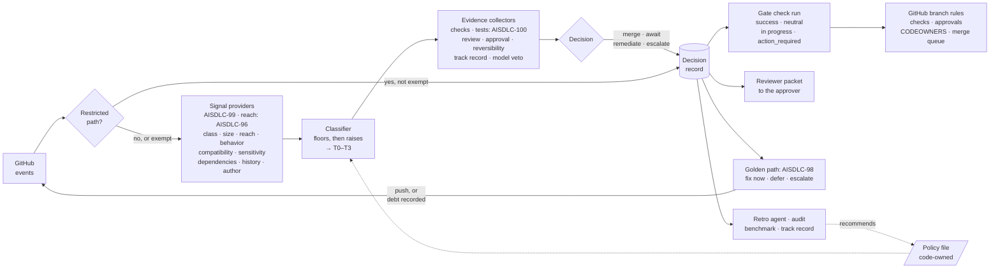
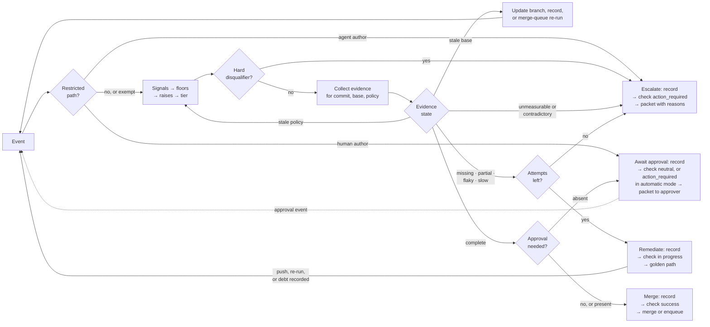
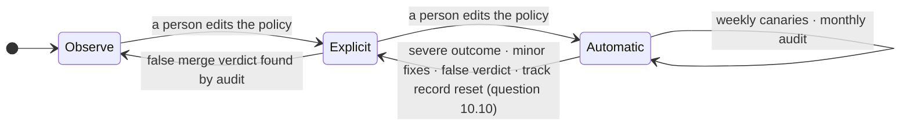

# AISDLC-97: Define Risk-Tiered MVE and Mergeability Contract

**Architecture design proposal** · draft for architecture review · Owner: Guy Oron · Reviewers: Ella Shulman (lead
architect, owner of [AISDLC-29]), Benjamin Kapner · 2026-09-28 · Jira: [AISDLC-97] (epic) under [AISDLC-29] (feature).
Terms are in Appendix A; every threshold in this document is a policy default (section 4.4).

## 1. Summary

**Problem.** [AISDLC-29] (Architecting Verification Debt Resolution & Minimal Viable Evidence for ADLC Auto-Merge) asks
for "the specific, dynamic testing thresholds an agent must meet to qualify for an auto-merge, based on the scope of
the change". Today every fullsend PR needs a human approval, the existing risk score ([ADR 0089], PR-level risk
assessment scoring) gates nothing, and low-risk dependency bumps wait 8–36 hours for a click (2026-09-23 triage
comment on [fullsend#3016], Renovate auto-merge).

**Decision, in six points.**

1. **A merge gate, not a merge bot.** A **trusted runtime** (a GitHub App run by the platform, outside any agent's
   sandbox, holding the only merge credential) computes one verdict per PR commit, **merge**, **await approval**,
   **remediate** or **escalate**, publishes it as a required GitHub check, and on *merge* merges through the
   repository's own merge path after re-fetching GitHub state. GitHub keeps enforcing checks, CODEOWNERS, the merge
   queue and, until a tier runs in automatic mode, approvals; in automatic mode the gate enforces approvals for the
   other tiers and for agent authors (section 5.2). This is the authority boundary of [ADR 0110] (dedicated auto-merge
   authority boundary, [fullsend#7151], unmerged), with one stated departure: the deterministic policy recommends and
   the model may only veto, where ADR 0110 asks the agent to recommend.
2. **Risk tier from consequence, not from file counts.** Four **risk tiers** T0–T3 are set by the riskiest signal
   (floors), never by an average; weaker signals only raise. Nine signals (change class, size, reach, behavior change,
   interface compatibility, sensitivity, dependencies, history, author) come from pluggable providers; the rule is
   fixed. Restricted paths (rules, prompts, credentials) are a separate policy evaluated first.
3. **Evidence scales with the tier, and unknown never merges.** Each tier names its **minimal viable evidence**
   (MVE). Missing evidence goes to [AISDLC-98]'s golden path (Define Verification Debt Taxonomy and Resolution Golden
   Path: fix now, defer as debt, or escalate); stale, contradictory or unmeasurable evidence never counts.
   **Agent-authored PRs keep one human approval at every tier**, as we read Red Hat's [AI code assistant guidelines]
   (question 10.1); for them the contract decides what must be in place before a person is asked, and which person;
   the gate then merges on its own. Our September classification script, run 2026-09-23 under its own earlier rules
   on the 246 PRs of [fullsend#4698] (the risk-score measurement thread), found 48 PRs of T0 or T1 shape: 13 would
   merge with no approval under this point (9 docs PRs by maintainers, 4 dependency bumps by an allowlisted bot); the
   other 35 were agent-authored and stay under human approval. Anything beyond docs and digest bumps is also blocked
   on post-merge outcome data and an approved model (section 9).
4. **Every decision writes a record before it acts**: PR, commit, base, policy version, every signal with its provider
   and version, the evidence, the outcome. Audits, fullsend's retro agent, the benchmark of past PRs (section 7) and the
   track record read it; only people turn what they read into policy.
5. **The system only tightens itself; people loosen it.** Each repository and tier runs in one of three modes,
   observe, explicit or automatic (section 7). A severe outcome stops automatic merging at once; the policy's
   minor-fix count in 30 days revokes it; the track record (minimum gate merges, 30-day fix rate) is what a person
   checks before loosening; a classifier, provider, model or prompt change resets the track record, and with it
   automatic mode. Every promotion is a code-owned edit of the policy file, as fullsend's fleet configuration already
   rejects "a less-restrictive candidate unless the manifest explicitly declares that relaxation" ([ADR 0122],
   declarative repo configuration).
6. **Deterministic decision, pluggable signals.** The same inputs give the same verdict; which tool supplies an input is
   a per-repository choice, recorded by name and version ("Every decision should be traceable to its inputs",
   [fullsend vision]).

**What we need from readers.** Confirm the six points and the split with the sibling epics (section 2); then the open
questions in section 10: Ella (10.1, 10.5, 10.10, 10.12), Benjamin (10.2), the policy owner (10.1, 10.3), fullsend
maintainers (10.3, 10.13), fullsend telemetry owners (10.4), Adam Scerra (10.6), Hofni Gartner (10.6, 10.9).

## 2. Context

fullsend scores every PR 1–5 (metadata 50%, git history 30%, linked issue 20%); [ADR 0089] says the score "is
informational only" and "the protected-path check remains the sole blocking mechanism". That check
(`REVIEW_PROTECTED_PATHS`, 22 prefixes by default) downgrades any agent approval to a comment. The autonomy model is
"binary per-repo with CODEOWNERS as the escape hatch" ([autonomy-spectrum]), graduation criteria "all TBD"; that
document names per-decision dimensions as a layer on top, and this design is that layer. [ADR 0110] proposes a
dedicated auto-merge stage and defers "schemas, trigger rules, queue protocols, storage, reconciliation, rollout gates,
and cohort definitions". Post-merge revert and defect rates are not visible ([fullsend#6892]). A model-emitted number
cannot be the gate: ADR 0089's sub-agent re-emits the deterministic signals, "introducing potential LLM-mediated
non-determinism", and its re-reviews once flipped 1→2 on identical rationale ([agents#1037], fixed by [agents#1038]).

**Sibling epics.** [AISDLC-97] decides how much evidence each risk tier needs and what happens when it is missing; the
siblings produce the evidence and tools, and until each lands its fallback applies:

- [AISDLC-96] Define Change-Impact and Coverage-Adequacy Model: a dependents count stands in for reach, and T1 and
  above never merge automatically.
- [AISDLC-98] Define Verification Debt Taxonomy and Resolution Golden Path: evidence gaps go to a person.
- [AISDLC-99] Assess Verification Tooling Capability and Architecture Gaps: a signal with no provider is unknown or
  waived (section 4.3); evidence with no producer is missing.
- [AISDLC-100] Design Minimal Relevant Test Selection and CI Capacity Strategy: full suites run.

## 3. Architecture



**Events** drive the loop (PR opened, synchronized, base changed, ready for review; check completed; review submitted;
`merge_group` checks requested; policy changed; a debt item recorded; a declared dependency PR closed); no polling,
and a reconciliation sweep covers missed webhooks. **Signal providers** are per-ecosystem
tools behind one interface: value, confidence, provider name and version. **Evidence collectors** are deterministic and
read GitHub state and CI outputs, never PR text; the model check is the one collector fed sanitized PR content
(question 10.12). The review verdict is read from the review agent's posted review, since the bot's native approval is
advisory to GitHub ([agents#1449] proposes a check run for it).

## 4. Policy model

**4.1 Restricted paths.** A per-repository list only people change: CODEOWNERS and branch rules, the policy file,
agent prompts and harness files, credentials and provider configuration, release configuration. An agent-authored PR
touching one is escalated; a human-authored one awaits the path's code owner; an exempt change (a digest-only or patch
bump by an allowlisted bot touching only the manifest and lockfile) passes its own deterministic check. fullsend's
`REVIEW_PROTECTED_PATHS` already has the list and the matching at the review step; this design moves it to the merge
step, adds the policy path (`.fullsend/` is not in the default list) and takes the bot-bump exemptions the backlog asks
for ([fullsend#7611], [fullsend#3239]) out of the prefix list. **Policy owner** = the code owners of the policy path
(on fullsend `main`: `@fullsend-ai/core`, enforced by `require_code_owner_review`).

**4.2 Risk tiers.** A risk tier is the consequence of a change if it is wrong and how easily it is undone. It is not
ADR 0089's score (an input to the history raise) and not fullsend's autonomy level, which this design layers on.

| Risk tier | Definition |
|---|---|
| **T0 Pre-authorized** | no intended behavior change in shipped code: docs only; tests only; a patch, pin or digest dependency bump passing supply-chain checks |
| **T1 Low** | a behavior change nothing reaches yet: new files or functions with no callers, or code behind a default-off flag; small hand-written size; few dependents |
| **T2 Standard** | a behavior change on reachable code inside the repository; compatible interfaces; nothing sensitive; no new dependency |
| **T3 Sensitive** | reaches other repositories or breaks an interface; auth, secrets, CI structure, migrations; new dependencies or minor/major bumps; irreversible or data-affecting; anything larger |

**4.3 Signals, floors and raises.** *Change class comes first* and decides which signals apply: docs-only (T0
candidate); tests-only (T0; weakened tests are a disqualifier); dependency-only (T0 or T3, by the dependencies signal);
configuration (T1 or above: sensitivity, behavior, size, history); generated-only (the tier of the hand-written diff it
came from, when a CI job regenerates it with no diff); code (all signals, T1 or above). Size is hand-written code lines
(added plus removed) and files, excluding docs, tests, generated and vendored files. A signal the class needs but the
repository has no provider for is **unknown** unless the policy declares a named waiver, written to the record. *Floors:
the riskiest applicable signal sets the tier, nothing averages it down; raises add; unknown never lowers* (an unknown
floor takes its highest value, an unknown raise counts as fired). An optional declared-path list raises by one.

| Signal | Floor | Raise | Example public providers (never a recommendation) |
|---|---|---|---|
| **Size** | over the T1 limit → T2; over T2 → T3 | – | `git diff --numstat`; `linguist-generated`; verify-generated jobs (kubernetes `verify-codegen`, kubevirt `generate-verify`, cluster-api `verify-gen`) |
| **Reach** (dependents in the repo; consumers in other repos; callers of changed symbols) | ≥ N dependents → T2; any consumer outside the repo → T3; [AISDLC-96]'s model replaces the count | low or unknown confidence → +1 | `go list -deps`, Bazel `rdeps`, Nx affected, jdeps; pkg.go.dev "Imported By" (`kubevirt.io/api/core/v1`: 784), GitHub dependency graph (public repos), Sourcegraph, SCIP; gopls or pyright call hierarchy |
| **Behavior change** (a line inside an existing function; code that first gains callers; a flag default flipped) | first-caller PR: the classifier re-runs on the diff of the code being wired in, with reach taken at the call site, and the PR takes the higher tier; a default flip: the same on the code the flag guards, never below T2 | – | call hierarchy from a code index; a diff of the flag definition file (OpenFeature CLI manifest, flagd), a convention rather than a tool feature; Kubernetes `verify-featuregates` |
| **Interface compatibility** (Go API, CRD, OpenAPI, protobuf, Java) | breaking → T3 | – | go-apidiff, gorelease; crdify, crd-schema-checker; oasdiff; `buf breaking`; japicmp |
| **Sensitivity** (auth, secrets, crypto, RBAC, CI structure, migrations; a new import of a risky standard package) | → T3; risky import → T2 | – | ADR 0089's security patterns; repository policy |
| **Dependencies** | new dependency, minor or major bump → T3; patch, pin or digest with clean supply-chain checks → T0 | – | manifest and lockfile diff; OSV-Scanner; OpenSSF Scorecard |
| **History** (a touched file reverted in 90 days; co-change partner missing; churn hotspot; untouched 180 days; "hack" commits; ADR 0089 score ≥ 3) | – | revert → +1; two or more others → +1 | `git log`, code-maat, PyDriller; the ADR 0089 sub-agent |
| **Author and intent** (agent, AI-assisted, human, allowlisted bot; labels) | issue labeled security or breaking-change → T3 | – | GitHub API; commit trailers |

**4.4 Policy file** (proposed shape; one YAML block per repository, code-owned, preset → overlay, tighten-only;
[ADR 0080], config.yaml vs agent env var scope, puts dispatch policy in `.fullsend/config.yaml`; values are examples,
and a value with no comment is our starting guess that the benchmark checks):

```yaml
merge_policy:                       # proposed; no such key exists in fullsend today
  mode: { T0: explicit, T1: observe, T2: observe, T3: observe }   # observe | explicit | automatic
  restricted_paths: { inherit: true, add: [.fullsend/], exemptions: [bot-digest-bump] }
  approvers: { T0: branch rule, T1: branch rule, T2: team, T3: code owner }   # agent-authored: always a person
  limits: { T1: {files: 10, lines: 100}, T2: {files: 25, lines: 800} }   # T1 lines: Cloudflare's "lite" review tier (blog.cloudflare.com/ai-code-review); the rest ours
  reach: { provider: <reach-provider>, dependents_floor_T2: 10, cross_repo_index: <org index> }
  compatibility: { providers: [<api-diff>, <schema-diff>] }
  waivers: []                       # signals this repository cannot compute; each use is recorded
  history: { revert_days: 90, quiet_days: 180, raise_signals: 2 }        # ADR 0089's signals plus a message heuristic
  evidence: { changed_lines_executed_T2: 0.80, checks_expected_time_pctl: 95 }   # 0.80: Sonar's new-code default
  fix_attempts: { per_commit: 2, per_pr: 4 }
  track_record: { min_merges: 50, max_fix_rate_30d: 0.02, resets_on: [classifier, provider, model, prompt] }
  revoke: { severe: immediate, minor_fixes_30d: 2 }
  observe: { min_days: 30, min_merges: 50 }
  branch_update: merge              # or rebase; no repository setting for the method was found
  record: { check_run: fullsend/merge-gate, store: <acknowledged store>, otel_mirror: true, retention_months: 12 }
  revert_runbook: docs/runbooks/revert.md   # required before automatic mode
```

## 5. Evidence

**5.1 Minimal viable evidence per risk tier.** All evidence is for the exact commit. At every tier GitHub requires
green checks and the gate reads the review verdict (section 3); both are recorded.

| Evidence | T0 | T1 | T2 | T3 |
|---|---|---|---|---|
| Tests cover the change ([AISDLC-96] criteria, [AISDLC-100] selection) | existing suite; none for docs | tests that reference the changed code | a test executed the changed hand-written lines (policy threshold) | as T2, plus integration or e2e, and consumers' tests when other repositories use it |
| Human approval | explicit mode: the branch rule's; automatic mode: none | as T0 | a team member | the code owner |
| Reversible | – | new code only, or a default-off flag | not irreversible | revert note if irreversible |
| Track record (automatic mode only) | ✓ | ✓ | – | – |
| Model check, veto only | docs and digest bumps: not required; else ✓ in automatic mode | ✓ in automatic mode | advisory | advisory |

Agent-authored PRs add one human approval at every tier (point 3); fullsend's review is authorship-blind
([code-review]), this merge policy is not (question 10.1). **Model check:** fixed yes/no questions where "yes" is a
concern (exceeds the issue's scope; weakens tests; removes a safeguard; contradicts its description; a dependency
change does more than the bump it claims), each with a probability checked against the benchmark's labeled outcomes;
advisory everywhere until that check exists; it can block, never approve (question 10.12). **Substitutes** count only
if the policy declares them, each use recorded: agent-written tests validated through [AISDLC-98]'s path and run in CI
on this commit; a recorded debt item in place of coverage, after which the PR needs the next tier's approval (at T3,
the code owner's); [AISDLC-100]'s selected subset at T1 when its confidence is high; a merge-queue run on the merged
result; the consumer's code owner approval when the consumer's tests cannot run. **Reviewer packet:** any PR that
waits for a person carries what changed and why, the signals that set the tier, each piece of evidence and what is
missing, and how to try it (demo steps; the same steps executed by CI; a per-PR preview environment as a GitHub
Deployment). The record keeps time to approval (`vcs.change.time_to_approval`) and whether the approver commented, so a
click-through on a 2,000-line diff is visible in audits; no threshold flags a person yet (question 10.2).

**5.2 Decision loop.** Hard disqualifiers, checked before any evidence: an agent-authored PR edits the gate's own
rules or prompts; the PR is a draft; its author is also its approver, or the agent would merge its own work; no linked
issue at T1 and above; weakened tests (an assertion removed, a test skipped, deleted or mocked away, found
deterministically). Any one escalates.



| Outcome | Check run | What happens |
|---|---|---|
| **Merge** | `success` | the trusted runtime re-fetches GitHub state and merges through the repository's merge path with its own identity, or enqueues and re-authorizes the queue's revision; GitHub's merge-when-ready is not used ([ADR 0110]; it also cannot enqueue on queue-protected branches with strict checks, [fullsend#5849]); a new push needs a new verdict |
| **Await approval** | explicit mode: `neutral` (GitHub counts it as passing; the branch's approval rule holds the merge); automatic mode: `action_required` | titled with the approver from `approvers`; the approval event re-enters the loop, so the gate merges on the exact approved commit and the approver never clicks merge. In automatic mode the branch's approval rule is dropped (it is per branch, not per tier), so the gate enforces approval for the other tiers and for agent authors |
| **Remediate** | in progress | the gap is worked through [AISDLC-98]'s path within the policy's attempt budget: a fix arrives as a push, a flaky re-run as a completed check (it consumes no attempt), a deferral as a recorded debt item, and all re-enter the loop; after the budget it escalates. A stale base is refreshed the same way: the gate updates the branch with its own identity and records it, or the merge queue re-runs |
| **Escalate** | `action_required` | reasons and packet; a person with bypass can still merge, and GitHub's rule insights log it |

In observe mode the check is not required and every verdict is published as `neutral` with the would-be outcome in
its title. Evidence problems, in [AISDLC-98]'s taxonomy: *missing or unavailable* → run the producer, else defer as
debt or escalate; *partial* (no test executed the changed lines) → remediate or defer, never merge; *stale* → a base
move stales evidence only when branch rules require an up-to-date branch or the intervening commits touch the same
packages, a policy change recomputes only; *flaky* → one re-run, a second failure is real, and T0–T1 accept only flaky
tests already marked as such that the change does not touch; *slow* → a required check past its own expected time (a
percentile of its past durations, kept in the record) counts as unavailable; *unmeasurable* → escalate;
*contradictory* → escalate with both readings, human signals outrank bot signals.

**Trace, PR B-1 (section 8).** Push c1: class code, a patch bump with clean supply-chain checks, reach 0 dependents,
T1; no test references the 9 new lines → remediate, record written, attempt 1 of 2, check in progress. Push c2 with a
unit test that references them: checks green, review clean → await approval, check `neutral`. Approval submitted →
merge, record written, check `success`, the runtime merges c2.

## 6. The decision record

One JSON document per verdict, shaped as an in-toto Statement so it can be signed later without a new format; no
credentials, no PR content beyond paths and counts (Level 1 metadata in [ADR 0050]'s terms, framework-native
distributed tracing with OpenTelemetry); the per-PR counterpart of the trust scorecard in [trustworthiness-evidence].

```json
{ "_type": "https://in-toto.io/Statement/v1", "subject": [{ "name": "fullsend-ai/fullsend#7890", "digest": { "gitCommit": "a1b2c3…" } }],
  "predicateType": "https://redhat.com/adlc/merge-decision/v1",
  "predicate": { "head_sha": "a1b2c3…", "base_sha": "9f8e…", "merge_group_sha": null, "policy_hash": "sha256:…", "classifier": "0.3.0",
    "change_class": "code", "risk_tier": "T2", "mode": "explicit",
    "signals": [ { "name": "reach.dependents", "value": 14, "confidence": "high", "provider": "go-list@1.25", "floor": "T2" } ],
    "evidence": [ { "name": "changed_lines_executed", "state": "partial", "value": 0.61, "source": "codecov:patch" } ],
    "substitutes": [], "disqualifiers": [], "waivers": [], "outcome": "remediate", "attempt": 1, "reasons": ["coverage_partial"],
    "approver": null, "decided_at": "2026-09-28T10:04:00Z" } }
```

**Where.** The source of truth is an *acknowledged store*: its write is confirmed before the check run concludes, and
only the platform host writes it, never the merge credential, so a leaked merge token cannot forge a record. Two
mirrors: the gate's check run on the commit (`external_id` = record id, `details_url` = the record, summary = the
packet; not an archive, since GitHub deletes check runs past 1000 per name and, from 2026-10-01, after the Actions
retention period, [GitHub checks retention]), and an OpenTelemetry event on a `merge-gate` task span (release-candidate
`vcs.*` and `cicd.*` attributes, the gate's fields under `fullsend.*`), best-effort by design. Which backend holds the
store for 12 months is an adopter decision (question 10.4); under a merge queue the record keys on the queue's revision.
**Readers:** the [retro agent] (runs when a PR closes), the monthly audit, the benchmark, and the trust scorecard's
`track_record`, keyed by configuration hash.

## 7. Trust over time



Per repository and risk tier. **Observe** (fullsend's "shadow mode"): the gate publishes tier and gaps as a `neutral`
check and merges nothing. **Explicit:** today's approval stays, but the gate merges, on the exact approved commit, once
its evidence is complete. **Automatic:** T0, later T1, merges with no approval for PRs by people or allowlisted bots.

- **Tightening is automatic.** A severe outcome (a security issue, a user-facing regression, data loss, or the andon
  cord in [production-feedback]) **revokes** automatic mode for that repository and tier at once and quarantines agent
  activity in the affected path; so does the policy's minor-fix count in 30 days. A false merge verdict found by the
  audit revokes automatic mode, or sends an explicit-mode tier back to observe. A *minor fix* is a fix PR referencing
  the merge within the look-back that is not a severe outcome (question 10.6). A classifier, provider, model or prompt
  change resets the track record ("a configuration change resets the track record for the dimensions affected by
  that change", [trustworthiness-evidence]), and since automatic mode requires it, the tier drops to explicit until
  it is rebuilt (question 10.10); a policy edit that changes a mode or threshold does not reset it, so a record
  earned in explicit mode carries into automatic mode.
- **Loosening is a person's edit** of the policy file, on the recommendation of the record's readers. The track record
  counts *gate merges* (the final verdict on each merged PR) against the policy's minimum, with at most its 30-day fix
  rate; the minor-fix rule revokes on its own, the rate is what a person checks before promoting.
- **Canaries** run on every policy, model or prompt change and weekly: planted PRs that must escalate (an out-of-scope
  edit, a weakened test, a hidden instruction, a rules-file edit, a split-PR wiring, a flag flip) and broken providers
  that must yield "unknown", never a merge (a missing check, a coverage tool returning nothing, a model timeout).
  **Monthly audit:** a person reads a random sample of verdicts against their issues and the approvers' findings.
- **Benchmark** (proposed by Hofni Gartner for [AISDLC-99]; moved into this epic by Ella): past PRs across several
  repositories, labeled by what happened after merge (a revert, a fix PR referencing them, a customer case): would the
  gate have merged a PR that later needed a fix, and which signal would have caught it? It sets the defaults in 4.4
  and checks the model check's probabilities. The 246 PRs of [fullsend#4698] test the pipeline, not the thresholds
  (their defects come from review findings); outcomes need [fullsend#6892].
- **Revert plan**, a precondition for automatic mode: who reverts (the tier's code owner); how to find affected merges
  (the record, plus a label); what to do when later work is built on top (revert newest first, turn the flag off, or fix
  forward with a person); a drill in the canary suite. GitHub has no atomic merge across repositories, so the
  compensating control is a revert of the whole set, keyed by the record.

## 8. Worked examples (mock data)

Numbers are invented; provider verdicts are the expected outputs for the described diffs, not tool runs. "Naive
rules" means raw size against the 4.4 limits plus a static core-path list; they misclassify A-2 and B-1 below.

| PR | Decisive signal | Risk tier and evidence |
|---|---|---|
| Docs only, 3 files, +120/−40 | change class: no code | T0: link check, render |
| Renovate patch bump of `k8s.io/client-go`, vendored, 41 files, 0 hand-written lines | dependency: patch, lockfile consistent, OSV clean | T0: build, unit, one smoke e2e |
| New helper `pkg/util/retry.go` nothing calls, +45 code, +80 tests | reach: 0 callers | T1: unit tests |
| The PR that wires the helper into `Reconcile`, +6/−2 | behavior: first caller on the hot path; the classifier re-runs on the helper's diff at that reach | T2: envtest on the reconcile loop; the helper's diff in the packet |
| Flag flip `--enable-live-migration` default off → on, +1/−1 | behavior: default flip of a whole feature | the feature's tier, at least T2: full e2e, upgrade test, revert = flip back |

**A Kubernetes operator API change across two repositories.** Repo A `vm-operator` (kubebuilder layout) adds an
optional field `spec.memoryOvercommitPercent` to `VirtualMachine`; repo B `vm-backup-operator` imports A's `api/v1`
and reads it.

| | A-1: optional field | A-2 (contrast): tighten a validation pattern on an existing field | B-1: module bump plus 9 lines using the field |
|---|---|---|---|
| Raw size | 12 files, +380 (8 generated: deepcopy, CRD, RBAC, clients, docs) | 2 files, +2/−2 | 7 files, +55 (5 vendored) |
| Hand-written size | 3 files, +53/−5 | 1 file, +1/−1 | 1 file, +9/−2 |
| Generated integrity | verify-generated job green → excluded | green | `go mod vendor` clean → excluded |
| Compatibility | additive (crdify clean, go-apidiff compatible) | **breaking**: existing objects may fail on update (crd-schema-checker: "tighten or loosen a regex") | not applicable |
| Reach | api module: 14 dependents (3 in-org, 11 external); 3 CRD consumers without Go; `Reconcile` hot path | same, plus every existing `VirtualMachine` in every cluster | 0 dependents of B's API |
| Dependencies | none | none | patch bump of A's api module, lockfile consistent, supply-chain clean → T0 floor; the 9 hand-written lines make the class code |
| Tests | +61 envtest lines; 92% of changed hand-written lines executed | none | none references the 9 new lines |
| Naive rules | T3 by the `api/` core-path rule | T1 on raw size | T0 as deps-only |
| **Risk tier** | **T3 by reach** (the same tier as the naive rule, for a reason that names the evidence: consumers' tests): envtest, one e2e on the field, consumers' tests or their owners' approval | **T3 by compatibility**: CRD compatibility gate, upgrade test with existing objects, revert runbook | **T1 by class and reach, with a gap**: remediate with a unit test, then merge (trace in 5.2) |

## 9. Rollout, alternatives, consequences

| Step | What happens | Needs first |
|---|---|---|
| 1 Observe | classify every PR; publish tier and gaps as a `neutral` check for the observe minimum | a classification script for change class, paths, size, dependents, author, history and the disqualifiers ([agents#1245], a script-computed signal tier and security floor, is a start); compatibility and behavior signals unknown or waived until a provider exists |
| 2 Explicit T0 | docs PRs and dependency bumps in one repository; the gate merges after the existing approval | the verdict as a required check from the gate's App, pinned as its expected source ([agents#1449] would be the precedent; question 10.13); approvals dismissed on push; supply-chain checks; the merge identity and enqueue path |
| 3 Automatic T0 | docs PRs and digest bumps by people and allowlisted bots merge with no approval; patch and pin bumps follow once the model check is calibrated | no false merge verdict in observe; outcome baseline ([fullsend#6892]); canaries green; revert runbook; the branch's approval rule dropped, the gate enforcing approval for T1–T3 and agent authors |
| 4 T1, then hold | T1 next; T2 and above stay human-approved until the data says otherwise | [AISDLC-96]'s impact model; reversibility and weakened-test providers ([AISDLC-99]); a calibrated model check on an approved model |

**Critical path.** Automatic mode beyond docs and digest bumps depends on post-merge outcomes ([fullsend#6892], open,
owner Adam Scerra), which the benchmark needs to set thresholds and calibrate the model check, and on a model approved
under the [AI code assistant guidelines]. The fallback, automatic T0 for docs and digest bumps only, needs neither.

**Alternatives.** A score or a model as the tier dilutes one serious signal and the model's re-reviews disagreed
(section 2): kept as a raise and a veto. A static list of core paths fails the operator case (section 8): kept as a
raise. Merge-on-green tools (Renovate `automerge`, Dependabot with GitHub auto-merge, Kodiak) and policy engines
(Mergify, Prow Tide, GitHub rulesets, OPA) decide from PR attributes and a fixed check list; none computes reach, though
OPA can evaluate the policy file once signals are inputs. **Costs:** a GitHub App with an acknowledged store and a
merge identity; a provider per ecosystem per signal; a policy file per repository; canary and runbook upkeep.
**Risks:** evidence gaming (split PRs, tests that touch but do not test); provider drift changing tiers silently
(versions are in the record); approval fatigue moving to escalations; over-blocking from unknowns while providers are
immature, which is why observe mode comes first.

## 10. Open questions

| # | Question | Owner | Our lean |
|---|---|---|---|
| 1 | Is our reading of the [AI code assistant guidelines] right: agent-authored PRs always get a human approval; a human author, AI-assisted or not, is the person in the loop; a bot bump with no AI is outside them? | policy owner; Ella | keep the approval; let the record show when it stops adding information |
| 2 | Approval at scale: is a packet plus time-to-approval enough, or a cap per approver and a "rubber stamp" threshold? GitHub does not expose which files an approver opened, and the literature disagrees on whether participation predicts defects ([McIntosh 2014] versus [Krutauz 2020]). Benjamin's "approver agent" that sees the evidence summary: a person with the packet, or an agent? | Benjamin | measure in observe; no threshold yet; a person with the packet |
| 3 | Who is the policy owner outside fullsend? | policy owner; fullsend maintainers | the code owners of the policy path |
| 4 | Which backend keeps the record's store for 12 months, and who runs it? Retention is open in [fullsend#294] (trace granularity and retention policy) | fullsend telemetry owners | the acknowledged store with an explicit retention; the OTLP backend keeps the mirror |
| 5 | Ella's "post" agent: is it the [retro agent] drawn in section 3? It runs at PR close, before outcomes exist; should a revert or fix PR referencing the merge re-run `/fs-retro` with the outcome as direction? | Ella | yes to both |
| 6 | What counts as a post-merge outcome (a revert, a fix PR referencing the merge, a customer case), and the look-back? | Adam Scerra ([fullsend#6892]); Hofni Gartner | revert or fix PR within 30 days; customer case any time |
| 7 | Multi-repo PR sets: declare-and-wait (a `Depends-On` footer, as Zuul reads it) or merge-order enforcement? | [AISDLC-96], this epic | declare-and-wait; producer merges first |
| 8 | Reach for private repositories: an org-wide `go.mod` scan or a SCIP index (the GitHub dependency graph covers public repositories only)? | [AISDLC-99], [AISDLC-96] | list both in the capability matrix |
| 9 | The defaults in 4.4 | Hofni Gartner's benchmark | starting values as listed |
| 10 | After a classifier, provider, model or prompt change: a full reset to explicit, or a shorter probation? | Ella | full reset |
| 11 | The revert runbook: this epic requires it; who writes it? | repository code owners; [AISDLC-98] for the template | a template here, filled per repository |
| 12 | Which model answers the model check, approved under which policy, fed what sanitized context? | [AISDLC-99]; Ella | after observe-mode data exists |
| 13 | Should the review bot publish a check run for its protected-path verdict now ([agents#1449])? | fullsend maintainers | yes; it would be the precedent for step 2 |

## Appendix A. Terms

*ADLC*: agentic software development lifecycle. *fullsend*: the open-source platform of forge agents (triage, code,
review, fix, retro, among others) at github.com/fullsend-ai, which this design targets on GitHub. *Trusted runtime*:
the platform-run GitHub App that holds the merge credential. *Risk tier* (4.2); *change class, floor, raise, unknown,
waiver* (4.3); *MVE*, the evidence a tier needs (5.1); *decision record* (6); *acknowledged store*, the record store
whose write is confirmed before the check run concludes (6); *restricted path* (4.1); *observe, explicit, automatic*
(7). *Escalate*: hand to a person. *Revoke*: the system removes a mode. *Quarantine*: halt agent activity in a path.
*Andon cord*: fullsend's halt-on-signal model in [production-feedback]. *Minor fix*: a fix PR referencing a merge
within the look-back that is not a severe outcome (7).

[AISDLC-29]: https://redhat.atlassian.net/browse/AISDLC-29
[AISDLC-96]: https://redhat.atlassian.net/browse/AISDLC-96
[AISDLC-97]: https://redhat.atlassian.net/browse/AISDLC-97
[AISDLC-98]: https://redhat.atlassian.net/browse/AISDLC-98
[AISDLC-99]: https://redhat.atlassian.net/browse/AISDLC-99
[AISDLC-100]: https://redhat.atlassian.net/browse/AISDLC-100
[ADR 0089]: https://github.com/fullsend-ai/fullsend/blob/main/docs/ADRs/0089-pr-risk-assessment-scoring.md
[ADR 0110]: https://github.com/fullsend-ai/fullsend/pull/7151
[ADR 0050]: https://github.com/fullsend-ai/fullsend/blob/main/docs/ADRs/0050-distributed-tracing-instrumentation.md
[ADR 0080]: https://github.com/fullsend-ai/fullsend/blob/main/docs/ADRs/0080-config-yaml-vs-agent-env-var-scope.md
[ADR 0122]: https://github.com/fullsend-ai/fullsend/blob/main/docs/ADRs/0122-declarative-repo-configuration.md
[autonomy-spectrum]: https://github.com/fullsend-ai/fullsend/blob/main/docs/problems/autonomy-spectrum.md
[trustworthiness-evidence]: https://github.com/fullsend-ai/fullsend/blob/main/docs/problems/trustworthiness-evidence.md
[production-feedback]: https://github.com/fullsend-ai/fullsend/blob/main/docs/problems/production-feedback.md
[code-review]: https://github.com/fullsend-ai/fullsend/blob/main/docs/problems/code-review.md
[fullsend vision]: https://github.com/fullsend-ai/fullsend/blob/main/docs/vision.md
[retro agent]: https://github.com/fullsend-ai/fullsend/blob/main/docs/agents/retro.md
[fullsend#294]: https://github.com/fullsend-ai/fullsend/issues/294
[fullsend#7151]: https://github.com/fullsend-ai/fullsend/pull/7151
[fullsend#3016]: https://github.com/fullsend-ai/fullsend/issues/3016
[fullsend#5849]: https://github.com/fullsend-ai/fullsend/issues/5849
[fullsend#6892]: https://github.com/fullsend-ai/fullsend/issues/6892
[fullsend#4698]: https://github.com/fullsend-ai/fullsend/issues/4698
[fullsend#7611]: https://github.com/fullsend-ai/fullsend/issues/7611
[fullsend#3239]: https://github.com/fullsend-ai/fullsend/issues/3239
[agents#1037]: https://github.com/fullsend-ai/agents/issues/1037
[agents#1038]: https://github.com/fullsend-ai/agents/pull/1038
[agents#1449]: https://github.com/fullsend-ai/agents/issues/1449
[agents#1245]: https://github.com/fullsend-ai/agents/pull/1245
[AI code assistant guidelines]: https://source.redhat.com/ (internal wiki; SSO)
[GitHub checks retention]: https://github.blog/changelog/2026-07-17-actions-retention-will-cover-checks-workflow-runs-and-statuses/
[McIntosh 2014]: https://dl.acm.org/doi/10.1145/2597073.2597076
[Krutauz 2020]: https://arxiv.org/abs/2005.09217
