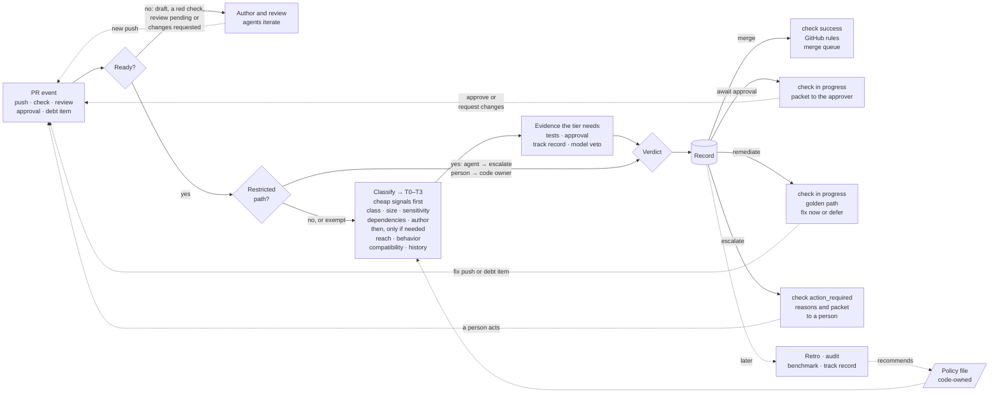
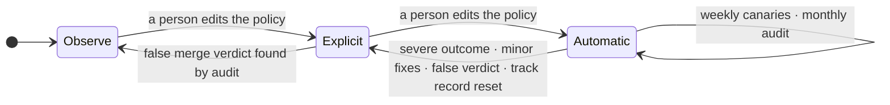

# AISDLC-97: Define Risk-Tiered MVE and Mergeability Contract

**Goal.** [AISDLC-29] asks what evidence an agent's PR must meet to merge automatically, scaled to the change. This contract answers three questions per PR commit: how risky it is, what
evidence that requires, and who may merge it.

## 1. Decisions

1. **A merge gate, not a merge bot.** A **trusted runtime** (a platform-run GitHub App outside any agent's sandbox,
   holding the only merge credential) computes one verdict per PR commit, **merge**, **await approval**, **remediate**
   or **escalate**, publishes it as a required check, and merges through the repository's own merge path. It evaluates a commit only once the PR is ready: not a draft, the other required checks green, the review agent's approval on that commit, and no open change request. [ADR 0110] (open) defines this authority boundary and leaves the unattended-merge scope to follow-up work; this
   contract is that scope. One departure: fit to the scope is computed deterministically and the model only vetoes,
   where ADR 0110 has an agent assess it.
2. **Risk tier from consequence, not from file counts.** Four risk tiers, T0 to T3, are set by the riskiest signal;
   weaker signals only raise the tier, and nothing averages it down. Signals come from pluggable per-repository tools,
   recorded by name and version. Cheap signals run first, and costly ones only when the change class needs them, once
   per ready commit. An approval or a recorded debt item on the same commit reuses its signals; a new push runs
   them again. The rule that combines them is fixed, so the same inputs always give the same verdict.
3. **Evidence scales with the tier, and unknown never merges.** Each tier names its **minimal viable evidence** (MVE).
   Missing evidence goes to [AISDLC-98]'s golden path (Define Verification Debt Taxonomy and Resolution Golden Path):
   fix now, defer as recorded debt, or escalate. Stale, contradictory or unmeasurable evidence never counts.
4. **Agents' PRs can merge automatically; people oversee the system, not each PR.** People decide which tiers merge
   automatically (a code-owned policy edit), approve every escalation with its evidence, audit a monthly sample, and
   a severe outcome revokes automatic mode at once. Agents' PRs start in explicit mode like every PR, and go automatic
   at T0, then T1, once they have a track record and Red Hat's AI policy owners confirm that this oversight meets the
   "human in the loop" of the [AI code assistant guidelines]. Our classification script, run on 2026-09-23
   with earlier rules over the 246 PRs of [fullsend#4698] (the risk-score measurement thread), found 48 of T0 or T1
   shape; 35 of them were agent-authored, the lane this epic exists for.
5. **Every decision writes a record before it acts**: commit, base, policy version, each signal with its tool and
   version, the evidence and the outcome. Audits, fullsend's [retro agent], the benchmark and the track record read it;
   only people turn what they read into policy.
6. **The system only tightens itself; people loosen it.** Each repository and tier runs in **observe**, **explicit** or
   **automatic** mode (section 5). A severe outcome, repeated fixes, or a change of classifier, tool, model or prompt drops a tier
   back on its own. Promotion is always a code-owned edit of the policy file, as fullsend's fleet configuration
   already rejects any loosening that isn't explicitly declared ([ADR 0122]).

## 2. Architecture

## 3. Risk tiers

A risk tier is how much harm a wrong change could do before a fix lands, and whether a fix can repair it at all\
Recovery means fixing forward (not reverting back a PR, as later PRs may already be built on this change)

| Risk tier | Definition |
|---|---|
| **T0 Pre-authorized** | no intended behavior change in shipped code: docs only, tests only, or a patch, pin or digest dependency bump that passes supply-chain checks |
| **T1 Low** | a behavior change nothing reaches yet: new code with no callers, or code behind a default-off flag; small hand-written size |
| **T2 Standard** | a behavior change in reachable code inside the repository; compatible interfaces; nothing sensitive; no new dependency |
| **T3 Sensitive** | reaches other repositories or breaks an interface; auth, secrets, CI structure or migrations; a new dependency or a minor or major bump; irreversible; anything larger |

**How the tier is set**, in order:

| Step | Rule | Why |
|---|---|---|
| **1. Restricted paths** | CODEOWNERS and branch rules, the policy file, agent prompts and harness files, credentials, release configuration, `.fullsend/`: an agent's PR escalates; a person's waits for the path's code owner. Exempt: an allowlisted bot's patch or digest bump that touches only the manifest and lockfile. | An agent can't rewrite the rules that judge it. fullsend's `REVIEW_PROTECTED_PATHS` does this at review; the gate repeats it at merge. |
| **2. Change class** | Docs or tests only → T0; dependency only → T0 or T3; configuration or code → T1; several classes → the riskiest. Generated files take the tier of the change behind them, and count as generated only if CI regenerates them with no diff. | Sets the starting tier and which signals run, so a docs PR never pays for costly signals. |
| **3. Signals** | The highest minimum wins; each raise adds one tier, up to T3; nothing lowers it. Size counts hand-written code only. A signal no tool can compute takes its riskiest value, unless the policy records a waiver. | The same inputs always give the same tier, and one serious signal can't be averaged away. |

| Signal | Effect on the tier | Example public tools |
|---|---|---|
| **Size** | over the T1 limit → T2; over the T2 limit → T3 | `git diff --numstat`; verify-generated CI jobs |
| **Reach (blast radius)** | 10+ dependents, direct or transitive → T2; 3+ layers deep → +1; any consumer in another repository → T3; low confidence → +1 | in-repo: `go list -deps`, Bazel `rdeps`; across repositories: org code search over `go.mod`, GUAC over SBOMs |
| **Behavior change** | the first caller of new code re-runs the classifier on that code at the caller's reach, and the PR takes the higher tier; a flag default flip takes the tier of the code it guards, at least T2 | code-index call hierarchy; flag-file diff |
| **Interface compatibility** | breaking → T3 | go-apidiff, crdify, oasdiff, `buf breaking`, japicmp |
| **Sensitivity** | auth, secrets, RBAC, CI, migrations → T3; a risky new import → T2 | ADR 0089's security patterns |
| **Dependencies** | patch, pin or digest with clean supply-chain checks → T0; new, minor or major → T3 | lockfile diff, OSV-Scanner, OpenSSF Scorecard |
| **History** | a touched file reverted in 90 days → +1; two other signs (a missing co-change, a hotspot, ADR 0089 score ≥ 3) → +1 | `git log`, code-maat, PyDriller |
| **Author and intent** | issue labeled security or breaking-change → T3 | GitHub API, commit trailers |

[AISDLC-96] owns the blast-radius model behind reach; this contract only sets its thresholds. Where no tool exists and the
policy waives the signal (flag flips in Go code, first callers, risky imports), a fixed model question can still raise the
tier, never lower it.

**Policy file.** Each repository keeps these settings in a code-owned block of `.fullsend/config.yaml` ([ADR 0080];
proposed, fullsend has no such block today), starting from an org-wide preset that it can make stricter but never
looser. These are starting guesses that the benchmark checks.

| Setting | T0 | T1 | T2 | T3 |
|---|---|---|---|---|
| Starting mode | observe | observe | observe | observe |
| Who approves | as the branch rule says | as the branch rule says | a team member | the code owner |
| Largest change (hand-written code) | – | 10 files, 100 lines | 25 files, 800 lines | no limit |
| Tests must run the changed lines | – | – | 80% | 80% |

## 4. Evidence and verdicts

**4.1 Minimal viable evidence.** Evidence is proof, for the exact commit, that the change was checked; the tier sets how much is
required, on top of the green required checks and review-agent approval that made the PR ready. Tests an agent wrote for its own change count only once they have passed
AISDLC-98's path and run in CI on this commit, so an agent never grades its own work.

| Evidence | T0 | T1 | T2 | T3 |
|---|---|---|---|---|
| Tests | existing suite; none for docs | tests that reference the changed code | tests executed ≥ 80% of the changed hand-written lines | as T2, plus integration or e2e, and consumers' tests if any |
| Human approval | explicit mode: today's rule; automatic mode: none | as T0 | a team member | the code owner, with a recovery plan if irreversible |
| Track record | automatic mode | automatic mode | – | – |
| Model check, veto only | automatic mode, except docs and digest bumps | automatic mode | advisory | advisory |

- **Model check:** fixed yes/no questions where "yes" is a concern: the PR exceeds the issue's scope, weakens tests,
  removes a safeguard, contradicts its description, or a dependency change does more than it claims. Each answer
  carries a probability calibrated against the benchmark, and until then it is advisory. It can block, never approve.
- **Substitutes** count only when the policy declares them, and each use is recorded: a debt item in place of coverage
  when the package has no measurable coverage, after which the PR needs the next tier's approver (at T3, the code
  owner); AISDLC-100's selected subset at T1 when its confidence is high; a merge-queue run on the merged result in
  place of checks on the exact commit; the consumer's code owner when consumers' tests cannot run.
- **Reviewer packet:** a PR that waits for a person carries what changed and why, the signals that set its tier, the
  evidence and what is missing, and how to try it. The record keeps time to approval, so a click-through on a
  2,000-line diff shows up in audits.

**4.2 Verdicts.** Before any evidence, hard disqualifiers escalate: an agent-authored PR edits the gate's rules or
prompts; its author is its approver; there is no linked issue at T1 or above; or tests were weakened
(an assertion removed, a test skipped, deleted or mocked away).

| Verdict | When | What happens |
|---|---|---|
| **Merge** | evidence complete and no approval pending (the tier is automatic, or the approval is in) | check `success`; the gate merges the exact commit; a new push needs a new verdict |
| **Await approval** | evidence complete, but a person must approve: explicit mode, a T2 or T3 approver, or an agent's PR the policy does not yet allow | check in progress; the approver gets the packet; the approval re-enters the loop, and the gate merges the approved commit |
| **Remediate** | evidence missing, partial, stale or flaky, and fixable within the attempt budget | check in progress; the gap goes to AISDLC-98's path; a fix push, a re-run or a recorded debt item re-enters the loop |
| **Escalate** | a hard disqualifier, an agent's PR on a restricted path, the budget spent, evidence unmeasurable or contradictory, or an unknown signal with no waiver | check `action_required`; reasons and packet go to a person; a person with bypass can still merge, and GitHub logs it |

Evidence problems following the [AISDLC-98] taxonomy

## 5. Record and trust over time

**The record** (decision 5) is the gate's log: one entry per verdict, written before the gate acts. It is kept for a
certain amount of time, still to be decided. It holds facts such as paths, counts and tool versions, never code or
secrets. It is written by a different identity from the one that merges, so a stolen merge key can't fake an entry. The
PR's check run only mirrors it.

**Modes** set how much the gate may do, per repository and tier. *Observe* (fullsend's "shadow mode"): the gate only
reports, and people merge as today. *Explicit*: people still approve, and the gate checks the evidence and merges.
*Automatic* (T0, later T1): the gate merges with no approval, first for people's and allowlisted bots' PRs, then for
agents' PRs once the policy allows them.

## 6. Rollout and critical path

Observe mode comes first: every PR gets a tier-and-gaps check, and nothing merges differently. T0 then goes explicit,
then automatic; T2 and T3 stay human-approved until the benchmark shows otherwise.

**Critical path.** Automatic merging beyond docs and digest bumps needs post-merge outcome data ([fullsend#6892]) and an approved model; agents' PRs also need the AI policy confirmation in decision 4. Without them, automatic T0 for docs and
digest bumps still works.

**Alternatives considered.** A score or a model as the tier lets one serious signal be averaged away and isn't
reproducible, so they only raise the tier or veto. Merge-on-green tools (Renovate automerge, Kodiak) and policy engines
(Mergify, Prow Tide, GitHub rulesets) decide from PR attributes and a fixed check list; none of them computes reach.

## 7. Worked examples (mock data)

Repository A, `vm-operator`, is a Kubernetes operator that owns the `VirtualMachine` API;
repository B, `vm-backup-operator`, imports it. *Naive rules* means a static core-path list, then "a dependency bump is
T0", then raw size against the same limits.

| PR | Naive rules | Decisive signal | Risk tier and required evidence |
|---|---|---|---|
| Docs only, 3 files, +120/−40 | T2 by raw size | change class: docs | **T0**: link check, render |
| Renovate patch bump of `k8s.io/client-go`, 41 vendored files | T0 | dependency: patch, lockfile consistent, OSV clean | **T0**: build, unit, one smoke e2e |
| New helper `pkg/util/retry.go` that nothing calls, +45 code, +80 tests | T2 by raw size | reach: no callers | **T1**: unit tests |
| Wire that helper into `Reconcile`, +6/−2 | T1 | behavior: first caller; re-tiered at `Reconcile`'s reach | **T2**: envtest on the reconcile loop |
| Flip `--enable-live-migration` from off to on, +1/−1 | T1 | behavior: default flip of a whole feature | **T2 or above**: full e2e, upgrade test |
| A-1: add optional field `spec.memoryOvercommitPercent`, 12 files, +380, 8 generated | T3 by the `api/` path | reach: 14 dependents, 11 outside the org | **T3**: envtest, e2e on the field, consumers' tests or their owners' approval |
| A-2: tighten a validation pattern on an existing field, +1/−1 | T3 by the `api/` path | compatibility: breaking, existing objects may fail on update | **T3**: CRD compatibility check, upgrade test with existing objects, recovery plan |
| B-1: bump A's module to the release with the field, and 9 lines using it; 7 files, 5 vendored | T0 (a bump) | dependency: a minor bump, since A-1 added a field | **T3**: e2e, B's code owner; gap: no test executes the 9 lines |

[AISDLC-29]: https://redhat.atlassian.net/browse/AISDLC-29
[AISDLC-96]: https://redhat.atlassian.net/browse/AISDLC-96
[AISDLC-97]: https://redhat.atlassian.net/browse/AISDLC-97
[AISDLC-98]: https://redhat.atlassian.net/browse/AISDLC-98
[AISDLC-99]: https://redhat.atlassian.net/browse/AISDLC-99
[AISDLC-100]: https://redhat.atlassian.net/browse/AISDLC-100
[fullsend]: https://github.com/fullsend-ai
[ADR 0089]: https://github.com/fullsend-ai/fullsend/blob/main/docs/ADRs/0089-pr-risk-assessment-scoring.md
[ADR 0110]: https://github.com/fullsend-ai/fullsend/pull/7151
[ADR 0080]: https://github.com/fullsend-ai/fullsend/blob/main/docs/ADRs/0080-config-yaml-vs-agent-env-var-scope.md
[ADR 0122]: https://github.com/fullsend-ai/fullsend/blob/main/docs/ADRs/0122-declarative-repo-configuration.md
[autonomy-spectrum]: https://github.com/fullsend-ai/fullsend/blob/main/docs/problems/autonomy-spectrum.md
[trustworthiness-evidence]: https://github.com/fullsend-ai/fullsend/blob/main/docs/problems/trustworthiness-evidence.md
[retro agent]: https://github.com/fullsend-ai/fullsend/blob/main/docs/agents/retro.md
[in-toto Statement]: https://github.com/in-toto/attestation/blob/main/spec/v1/statement.md
[fullsend#294]: https://github.com/fullsend-ai/fullsend/issues/294
[fullsend#3016]: https://github.com/fullsend-ai/fullsend/issues/3016
[fullsend#4698]: https://github.com/fullsend-ai/fullsend/issues/4698
[fullsend#5849]: https://github.com/fullsend-ai/fullsend/issues/5849
[fullsend#6892]: https://github.com/fullsend-ai/fullsend/issues/6892
[agents#1037]: https://github.com/fullsend-ai/agents/issues/1037
[agents#1245]: https://github.com/fullsend-ai/agents/pull/1245
[agents#1449]: https://github.com/fullsend-ai/agents/issues/1449
[AI code assistant guidelines]: https://source.redhat.com/projects_and_programs/ai/wiki/code_assistants_guidelines_for_responsible_use_of_ai_code_assistants
[GitHub check runs]: https://docs.github.com/en/rest/checks/runs
[GitHub checks retention]: https://github.blog/changelog/2026-07-17-actions-retention-will-cover-checks-workflow-runs-and-statuses/
[Sonar quality gate]: https://docs.sonarsource.com/sonarqube-server/quality-standards-administration/managing-quality-gates/introduction-to-quality-gates
[Cloudflare's AI code review]: https://blog.cloudflare.com/ai-code-review/
[McIntosh 2014]: https://dl.acm.org/doi/10.1145/2597073.2597076
[Krutauz 2020]: https://arxiv.org/abs/2005.09217
