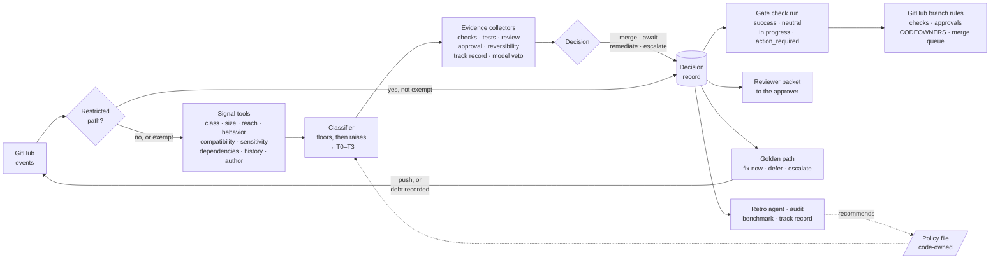
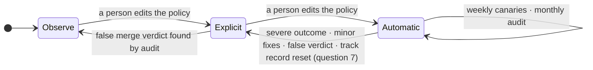

# AISDLC-97: Define Risk-Tiered MVE and Mergeability Contract

**Goal.** [AISDLC-29] asks what evidence an agent's PR must meet to merge automatically, scaled to the change. This contract answers three questions per PR commit: how risky it is, what
evidence that requires, and who may merge it.

## 1. Decisions

1. **A merge gate, not a merge bot.** A **trusted runtime** (a platform-run GitHub App outside any agent's sandbox,
   holding the only merge credential) computes one verdict per PR commit, **merge**, **await approval**, **remediate**
   or **escalate**, publishes it as a required check, and merges through the repository's own merge path. This is the authority boundary of [ADR 0110] (dedicated auto-merge authority
   boundary, unmerged) with one departure: our policy recommends and the model only vetoes, where ADR 0110 has the
   agent recommend.
2. **Risk tier from consequence, not from file counts.** Four risk tiers, T0 to T3, are set by the riskiest signal;
   weaker signals only raise the tier, and nothing averages it down. Signals come from pluggable per-repository tools,
   recorded by name and version. The rule that combines them is fixed, so the same inputs always give the same verdict.
3. **Evidence scales with the tier, and unknown never merges.** Each tier names its **minimal viable evidence** (MVE).
   Missing evidence goes to [AISDLC-98]'s golden path (Define Verification Debt Taxonomy and Resolution Golden Path):
   fix now, defer as recorded debt, or escalate. Stale, contradictory or unmeasurable evidence never counts.
4. **Agents' PRs can merge automatically; people oversee the system, not each PR.** People decide which tiers merge
   automatically (a code-owned policy edit), approve every escalation with its evidence, audit a monthly sample, and
   a severe outcome revokes automatic mode at once. Agents' PRs start in explicit mode like every PR, and go automatic
   at T0, then T1, once they have a track record and Red Hat's AI policy owners confirm that this oversight meets the
   "human in the loop" of the [AI code assistant guidelines] (question 1). Our classification script, run on 2026-09-23
   with earlier rules over the 246 PRs of [fullsend#4698] (the risk-score measurement thread), found 48 of T0 or T1
   shape; 35 of them were agent-authored, the lane this epic exists for.
5. **Every decision writes a record before it acts**: commit, base, policy version, each signal with its tool and
   version, the evidence and the outcome. Audits, fullsend's [retro agent], the benchmark and the track record read it;
   only people turn what they read into policy.
6. **The system only tightens itself; people loosen it.** Each repository and tier runs in **observe**, **explicit** or
   **automatic** mode (section 5). A severe outcome, repeated fixes, or a change of classifier, tool, model or prompt drops a tier
   back on its own. Promotion is always a code-owned edit of the policy file, the tighten-only rule that fullsend's
   fleet configuration already applies ([ADR 0122], declarative repo configuration).

## 2. Architecture

Events (pushes, checks, reviews, policy changes, recorded debt) drive the loop.
Signal tools return a value, a confidence, and their name and
version. Evidence collectors read GitHub state and CI outputs, never PR text; only the model check sees sanitized PR
content.

## 3. Risk tiers

A risk tier is how bad a wrong change would be and how easily it is undone; it is not ADR 0089's score (that feeds the
history signal) or fullsend's per-repository autonomy level ([autonomy-spectrum]).

| Risk tier | Definition |
|---|---|
| **T0 Pre-authorized** | no intended behavior change in shipped code: docs only, tests only, or a patch, pin or digest dependency bump that passes supply-chain checks |
| **T1 Low** | a behavior change nothing reaches yet: new code with no callers, or code behind a default-off flag; small hand-written size |
| **T2 Standard** | a behavior change in reachable code inside the repository; compatible interfaces; nothing sensitive; no new dependency |
| **T3 Sensitive** | reaches other repositories or breaks an interface; auth, secrets, CI structure or migrations; a new dependency or a minor or major bump; irreversible; anything larger |

**How the tier is set**, in order:

1. **Restricted paths.** CODEOWNERS and branch rules, the policy file, agent prompts and harness files,
   credentials and provider configuration, release configuration. An agent-authored PR touching one escalates; a human-authored one waits for the path's code owner. A
   patch or digest bump by an allowlisted bot that touches only the manifest and lockfile is exempt. fullsend's
   `REVIEW_PROTECTED_PATHS` already applies such a list at review time; the gate enforces it at merge and adds
   `.fullsend/`.
2. **Change class** decides which signals apply. Docs-only and tests-only are T0 candidates, dependency-only is T0 or
   T3, configuration and code start at T1, and generated files take the tier of the hand-written change behind them. Files count as generated only when a CI job
   regenerates them and finds no diff; otherwise they are hand-written.
3. **Signals set a floor, then raise it.** Size counts hand-written code only; docs, tests, generated and vendored files are excluded. A signal the class needs but no tool can
   compute is **unknown** and takes its riskiest value, unless the policy names a waiver, which is recorded.

| Signal | Effect on the tier | Example public tools |
|---|---|---|
| **Size** | over the T1 limit → T2; over the T2 limit → T3 | `git diff --numstat`; verify-generated CI jobs |
| **Reach (blast radius)** | 10+ dependents, direct or transitive → T2; 3+ layers deep → +1; any consumer in another repository → T3; low confidence → +1 | in-repo: `go list -deps`, Bazel `rdeps`; across repositories: org code search over `go.mod`, GUAC over SBOMs |
| **Behavior change** | the first caller of new code re-runs the classifier on that code at the caller's reach, and the PR takes the higher tier; a flag default flip takes the tier of the code it guards, at least T2 | code-index call hierarchy; flag-file diff |
| **Interface compatibility** | breaking → T3 | go-apidiff, crdify, oasdiff, `buf breaking`, japicmp |
| **Sensitivity** | auth, secrets, RBAC, CI, migrations → T3; a risky new import → T2 | ADR 0089's security patterns |
| **Dependencies** | patch, pin or digest with clean supply-chain checks → T0; new, minor or major → T3 | lockfile diff, OSV-Scanner, OpenSSF Scorecard |
| **History** | a touched file reverted in 90 days → +1; two other signs (a missing co-change, a hotspot, ADR 0089 score ≥ 3) → +1 | `git log`, code-maat, PyDriller |
| **Author and intent** | issue labeled security or breaking-change → T3 | GitHub API, commit trailers |

Reach reads a dependency graph (a DAG of packages, services and repositories) joined across the org; [AISDLC-96]
owns how breadth, depth and confidence combine into a blast radius.

**Policy file.** Each repository keeps these settings in a code-owned block of `.fullsend/config.yaml` ([ADR 0080];
proposed, fullsend has no such block today), starting from an org-wide preset that it can make stricter but never
looser. These are starting guesses that the benchmark (section 5) checks.

| Setting | T0 | T1 | T2 | T3 |
|---|---|---|---|---|
| Starting mode | explicit | observe | observe | observe |
| Who approves | as the branch rule says | as the branch rule says | a team member | the code owner |
| Largest change (hand-written code) | – | 10 files, 100 lines | 25 files, 800 lines | no limit |
| Tests must run the changed lines | – | – | 80% | 80% |

For the whole repository:

- **Agents' PRs merge automatically:** off until the AI policy owners agree (question 1).
- **Fix attempts before a person is asked:** 2 per commit, 4 per PR.
- **Track record before automatic mode:** at least 50 gate merges, with at most 2% needing a fix within 30 days. The
  count restarts when the classifier, a tool, the model or a prompt changes.
- **Automatic mode switches off:** at once after a severe outcome, or after 2 minor fixes in 30 days.
- **Waivers:** none by default. A signal the repository cannot compute can be waived by name, and each use is recorded.
- **Revert runbook:** required before automatic mode.

## 4. Evidence and verdicts

**4.1 Minimal viable evidence.** All evidence is for the exact commit. Every tier also needs green required checks and
a clean verdict from the review agent. Tests an agent wrote for its own change count only once they have passed
AISDLC-98's path and run in CI on this commit, so an agent never grades its own work.

| Evidence | T0 | T1 | T2 | T3 |
|---|---|---|---|---|
| Tests ([AISDLC-96] adequacy, [AISDLC-100] selection) | existing suite; none for docs | tests that reference the changed code | tests executed ≥ 80% of the changed hand-written lines | as T2, plus integration or e2e, and consumers' tests if any |
| Human approval | explicit mode: today's rule; automatic mode: none | as T0 | a team member | the code owner |
| Reversible | – | new code only, or a default-off flag | not irreversible | a revert note if irreversible |
| Track record | automatic mode | automatic mode | – | – |
| Model check, veto only | automatic mode, except docs and digest bumps | automatic mode | advisory | advisory |

- **Model check:** fixed yes/no questions where "yes" is a concern: the PR exceeds the issue's scope, weakens tests,
  removes a safeguard, contradicts its description, or a dependency change does more than it claims. Each answer
  carries a probability calibrated against the benchmark, and until then it is advisory. It can block, never approve.
- **Substitutes** count only when the policy declares them, and each use is recorded: a debt item in place of coverage
  when the package has no measurable coverage, after which the PR needs the next tier's approver (at T3, the code
  owner); AISDLC-100's selected subset at T1 when its confidence is high; a merge-queue run on the merged result in
  place of checks on the exact commit; the consumer's code owner when consumers' tests cannot run.
- **Reviewer packet:** a PR that waits for a person carries what changed and why, the signals that set its tier, the
  evidence and what is missing, and how to try it. The record keeps time to approval, so a click-through on a
  2,000-line diff shows up in audits.

**4.2 Verdicts.** Before any evidence, hard disqualifiers escalate: an agent-authored PR edits the gate's rules or
prompts; the PR is a draft; its author is its approver; there is no linked issue at T1 or above; or tests were weakened
(an assertion removed, a test skipped, deleted or mocked away).

| Verdict | When | What happens |
|---|---|---|
| **Merge** | evidence complete and no approval pending (the tier is automatic, or the approval is in) | the gate merges the exact commit; a new push needs a new verdict |
| **Await approval** | evidence complete, but a person must approve: explicit mode, a T2 or T3 approver, or an agent's PR the policy does not yet allow | the approver gets the packet; the approval re-enters the loop, and the gate merges the approved commit |
| **Remediate** | evidence missing, partial, stale or flaky, and fixable within the attempt budget | the gap goes to AISDLC-98's path; a fix push, a re-run or a recorded debt item re-enters the loop |
| **Escalate** | a hard disqualifier, an agent's PR on a restricted path, the budget spent, evidence unmeasurable or contradictory, or an unknown signal with no waiver | reasons and packet go to a person; a person with bypass can still merge, and GitHub logs it |

Every PR commit gets exactly one of these four; await approval and escalate are the epic's "human approval".
In observe mode the verdict is reported, never acted on. Evidence
problems follow AISDLC-98's taxonomy: *missing* → run the producer, else defer or escalate; *partial* (below that share) →
remediate or defer, never merge; *stale* → update the branch (rebase or merge, per the repository) or let the merge queue retest,
then recompute; a base move stales evidence only if the branch must be up to date or the
new base commits touch the same packages; *flaky* → one re-run, and a second failure is real, except that T0 and T1 accept a test AISDLC-98's path already
marked flaky if the change does not touch it; *slow* → past its usual
duration counts as missing; *unmeasurable* or *contradictory* → escalate.

## 5. Record and trust over time

**The record** (decision 5) must be kept at least 12 months, hold no credentials and no PR content beyond paths and
counts, and be written where the merge identity cannot write, so a leaked merge token cannot forge history. The PR's
check run only mirrors it: from 2026-10-01 GitHub deletes check runs after the Actions retention period, 90 days by
default ([GitHub checks retention]).

**Modes**, per repository and tier. *Observe* (fullsend's "shadow mode"): the gate publishes tier and gaps and merges
nothing. *Explicit*: today's approval stays, and the gate merges the approved commit once its evidence is complete.
*Automatic*: T0, later T1, merges with no approval: PRs by people and allowlisted bots first, agents' PRs once the
policy allows them.

- **Tightening is automatic.** A severe outcome (a security issue, a user-facing regression, data loss, or fullsend's
  andon cord, a halt on a production signal) revokes automatic mode for that repository and tier at once and quarantines agent activity in the path.
  So do two minor fixes (fix PRs referencing the merge) in 30 days, and a false merge verdict found by the audit. A
  change of classifier, tool, model or prompt resets the track record ([trustworthiness-evidence]), so the tier drops
  to explicit until the record is rebuilt.
- **Loosening is a person's edit** of the policy file, once the record supports it: leaving observe needs at least 30
  days and 50 PRs; automatic mode needs at least 50 gate merges with at most 2% needing a fix within 30 days. A mode
  or threshold edit does not reset the track record, so merges earned in explicit mode count.
- **The gate is tested continuously.** Weekly and on every change, canary PRs must escalate (an out-of-scope edit, a
  weakened test, a hidden instruction, a rules-file edit, a split-PR wiring, a flag flip), and broken tools must yield
  unknown, never a merge. Each month a person audits a random sample of verdicts.
- **Benchmark** (proposed by Hofni Gartner, moved into this epic by Ella): past PRs from several repositories, labeled
  by what happened after merge. Would the gate have merged a PR that later needed a fix, and which signal would have
  caught it? It sets the policy defaults and calibrates the model check. It needs post-merge outcome data
  ([fullsend#6892]); the 246 PRs of fullsend#4698 were collected to evaluate ADR 0089's scorer, with defects taken
  from review findings, so they test the pipeline, not the thresholds.
- **Revert plan**, required before automatic mode: who reverts (the tier's code owner), how to find affected merges
  (the record), what to do when later work builds on top, and a drill in the canary suite.

## 6. Worked examples (mock data)

Numbers are invented. Repository A, `vm-operator`, is a Kubernetes operator that owns the `VirtualMachine` API;
repository B, `vm-backup-operator`, imports it. *Naive rules* means a static core-path list, then "a dependency bump is
T0", then raw size against the same limits.

| PR | Naive rules | Decisive signal | Risk tier and required evidence |
|---|---|---|---|
| Docs only, 3 files, +120/−40 | T2 by raw size | change class: docs | **T0**: link check, render |
| Renovate patch bump of `k8s.io/client-go`, 41 vendored files | T0 | dependency: patch, lockfile consistent, OSV clean | **T0**: build, unit, one smoke e2e |
| New helper `pkg/util/retry.go` that nothing calls, +45 code, +80 tests | T2 by raw size | reach: no callers | **T1**: unit tests |
| Wire that helper into `Reconcile`, +6/−2 | T1 | behavior: first caller; re-tiered at `Reconcile`'s reach | **T2**: envtest on the reconcile loop |
| Flip `--enable-live-migration` from off to on, +1/−1 | T1 | behavior: default flip of a whole feature | **T2 or above**: full e2e, upgrade test |
| A-1: add optional field `spec.memoryOvercommitPercent`, 12 files, +380, 8 generated | T3 by the `api/` path | reach: 14 dependents, 11 outside the org | **T3**: envtest, e2e on the field, consumers' tests or their owners' approval |
| A-2: tighten a validation pattern on an existing field, +1/−1 | T3 by the `api/` path | compatibility: breaking, existing objects may fail on update | **T3**: CRD compatibility check, upgrade test with existing objects, revert runbook |
| B-1: bump A's module to the release with the field, and 9 lines using it; 7 files, 5 vendored | T0 (a bump) | dependency: a minor bump, since A-1 added a field | **T3**: e2e, B's code owner; gap: no test executes the 9 lines |

Naive rules get five of the eight wrong (two too strict, three too lax); on A-1 and A-2 a path list reaches T3 but cannot
say what evidence either needs. B-1 end to end, with B's T3 in explicit mode and A-1 merged first (question 6):
push 1 → remediate (attempt 1 of 2, check in progress); push 2 adds a unit test that executes the 9 lines and e2e
passes → await the code owner's approval (`neutral`); the approval arrives → the gate merges push 2.

## 7. Rollout and critical path

Observe mode comes first: every PR gets a tier-and-gaps check, and nothing merges differently. T0 then goes explicit,
then automatic; T2 and T3 stay human-approved until the benchmark shows otherwise.

**Critical path.** Automatic merging beyond docs and digest bumps needs post-merge outcome data ([fullsend#6892], owner
Adam Scerra) and an approved model; agents' PRs also need question 1 answered. Without them, automatic T0 for docs and
digest bumps still works.

**Alternatives considered.** A score or a model as the tier lets one serious signal be averaged away and isn't
reproducible, so they only raise the tier or veto. Merge-on-green tools (Renovate automerge, Kodiak) and policy engines
(Mergify, Prow Tide, GitHub rulesets) decide from PR attributes and a fixed check list; none of them computes reach.

## 8. Open questions

| # | Question |
|---|---|
| 1 | The [AI code assistant guidelines] ask a person to review AI-generated code; written for people using assistants, they don't mention PR approval or agents that open PRs. Does oversight of the system (policy, escalations, audit, revocation) meet their "human in the loop" for agents' PRs at T0 and T1? |
| 2 | Approval at scale: are the packet and time-to-approval enough, or do we need a per-approver cap or a rubber-stamp threshold (research disagrees: [McIntosh 2014], [Krutauz 2020])? |
| 3 | Who owns the policy outside fullsend, and who writes each repository's revert runbook? |
| 4 | Is the "post" agent fullsend's [retro agent]? It runs when a PR closes, before outcomes exist; should a revert or fix PR re-run it with the outcome? |
| 5 | What counts as a post-merge outcome, over what look-back, and which policy defaults does the benchmark confirm? |
| 6 | Multi-repository PR sets: declare-and-wait (a `Depends-On` footer, as Zuul reads it) or enforced merge order? |
| 7 | After a classifier, tool, model or prompt change: a full reset to explicit, or a shorter probation? |
| 8 | Which model answers the model check, approved under which policy, fed what sanitized context? |

[AISDLC-29]: https://redhat.atlassian.net/browse/AISDLC-29
[AISDLC-96]: https://redhat.atlassian.net/browse/AISDLC-96
[AISDLC-97]: https://redhat.atlassian.net/browse/AISDLC-97
[AISDLC-98]: https://redhat.atlassian.net/browse/AISDLC-98
[AISDLC-99]: https://redhat.atlassian.net/browse/AISDLC-99
[AISDLC-100]: https://redhat.atlassian.net/browse/AISDLC-100
[fullsend]: https://github.com/fullsend-ai
[ADR 0089]: https://github.com/fullsend-ai/fullsend/blob/main/docs/ADRs/0089-pr-risk-assessment-scoring.md
[ADR 0110]: https://github.com/fullsend-ai/fullsend/pull/7151
[ADR 0080]: https://github.com/fullsend-ai/fullsend/blob/main/docs/ADRs/0080-config-yaml-vs-agent-env-var-scope.md
[ADR 0122]: https://github.com/fullsend-ai/fullsend/blob/main/docs/ADRs/0122-declarative-repo-configuration.md
[autonomy-spectrum]: https://github.com/fullsend-ai/fullsend/blob/main/docs/problems/autonomy-spectrum.md
[trustworthiness-evidence]: https://github.com/fullsend-ai/fullsend/blob/main/docs/problems/trustworthiness-evidence.md
[retro agent]: https://github.com/fullsend-ai/fullsend/blob/main/docs/agents/retro.md
[in-toto Statement]: https://github.com/in-toto/attestation/blob/main/spec/v1/statement.md
[fullsend#294]: https://github.com/fullsend-ai/fullsend/issues/294
[fullsend#3016]: https://github.com/fullsend-ai/fullsend/issues/3016
[fullsend#4698]: https://github.com/fullsend-ai/fullsend/issues/4698
[fullsend#5849]: https://github.com/fullsend-ai/fullsend/issues/5849
[fullsend#6892]: https://github.com/fullsend-ai/fullsend/issues/6892
[agents#1037]: https://github.com/fullsend-ai/agents/issues/1037
[agents#1245]: https://github.com/fullsend-ai/agents/pull/1245
[agents#1449]: https://github.com/fullsend-ai/agents/issues/1449
[AI code assistant guidelines]: https://source.redhat.com/projects_and_programs/ai/wiki/code_assistants_guidelines_for_responsible_use_of_ai_code_assistants
[GitHub check runs]: https://docs.github.com/en/rest/checks/runs
[GitHub checks retention]: https://github.blog/changelog/2026-07-17-actions-retention-will-cover-checks-workflow-runs-and-statuses/
[Sonar quality gate]: https://docs.sonarsource.com/sonarqube-server/quality-standards-administration/managing-quality-gates/introduction-to-quality-gates
[Cloudflare's AI code review]: https://blog.cloudflare.com/ai-code-review/
[McIntosh 2014]: https://dl.acm.org/doi/10.1145/2597073.2597076
[Krutauz 2020]: https://arxiv.org/abs/2005.09217
