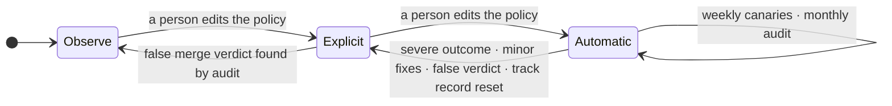

# AISDLC-97: Define Risk-Tiered MVE and Mergeability Contract

**Goal.** [AISDLC-29] asks what evidence an agent's PR must meet to merge automatically, scaled to the change. This contract answers three questions per PR commit: how risky it is, what
evidence that requires, and who may merge it.

## 1. At a glance

Every ready PR commit gets a risk tier; the tier sets the evidence it needs and who approves it.

A risk tier is how much harm a wrong change could do before a fix lands, and whether a fix can repair it at all\
Recovery means fixing forward (not reverting back a PR, as later PRs may already be built on this change)

| Risk tier | Definition | Evidence | Who approves |
|---|---|---|---|
| **T0 Pre-authorized** | no intended behavior change in shipped code: docs only, tests only, or a patch, pin or digest dependency bump that passes supply-chain checks | the existing suite; for docs, the docs build | today's rule; none once automatic |
| **T1 Low** | a behavior change nothing reaches yet: new code with no callers, or code behind a default-off flag; small hand-written size | tests that reference the changed code | today's rule; none once automatic |
| **T2 Standard** | a behavior change in reachable code inside the repository; compatible interfaces; nothing sensitive; no new dependency | tests executing ≥ 80% of the changed lines | a team member |
| **T3 Sensitive** | reaches other repositories or breaks an interface; auth, secrets, CI structure or migrations; a new dependency or a minor or major bump; irreversible; anything larger | T2's tests plus e2e and consumers' tests | the code owner |

[Mermaid source (opens an editable copy)][mermaid-architecture]

## 2. Proposed decisions

1. **A merge gate, not a merge bot.** A **trusted runtime** (a platform-run GitHub App outside any agent's sandbox,
   holding the only merge credential) computes one verdict per PR commit, **merge**, **await approval**, **remediate**
   or **escalate**, publishes it as a required check, and merges through the repository's own merge path. It evaluates a commit only once the PR is ready: not a draft, the other required checks green, the review agent's approval on that commit (the review also judges intent: whether the change does what its issue asks), and no open change request. [ADR 0110] (open) defines this authority boundary and leaves the unattended-merge scope to follow-up work; this
   contract is that scope. One departure: fit to the scope is computed deterministically and the model only vetoes,
   where ADR 0110 has an agent assess it: a model's risk score flipped from 1 to 2 on identical reasoning ([agents#1037]),
   and a merge decision must give the same answer for the same inputs.
2. **Risk tier from consequence, not from file counts.** Four risk tiers, T0 to T3, are set by the riskiest signal;
   weaker signals only raise the tier, and nothing averages it down. Signals come from pluggable per-repository tools,
   recorded by name and version. The review agent's risk assessment ([ADR 0089]) is one of those signals, not a second tier.
   Cheap signals run first, and costly ones only when the change class needs them, once
   per ready commit. An approval or a recorded debt item on the same commit reuses its signals; a new push runs
   them again. The rule that combines them is fixed, so the same inputs always give the same verdict.
3. **Evidence scales with the tier.** Each tier names its **minimal viable evidence** (MVE).
   Missing evidence goes to [AISDLC-98]'s golden path:
   fix now, defer as recorded debt, or escalate. Stale, contradictory or unmeasurable evidence never counts.
4. **Agents' PRs can merge automatically; humans ON the loop, not in the loop: they oversee the system, not each PR.** People decide
   which tiers merge automatically (a code-owned policy edit), approve every escalation with its evidence, audit a
   monthly sample, and a severe outcome (a security issue, a user-facing regression, data loss, or a halt on a
   production signal) revokes automatic mode at once.
5. **Every verdict is written down before the gate acts.** The record says which commit was judged and against which
   base and policy version, what each signal found and which tool (and version) found it, what evidence was there, and
   the verdict. Audits, fullsend's [retro agent], the benchmark (past PRs labeled by what happened after they merged) and the track record read it; only people turn what
   they read into policy.
6. **For now, the system only tightens itself; people loosen it (configurable, per TEAM/ORG).** Each repository and tier runs in **observe**, **explicit** or
   **automatic** mode (section 5). A severe outcome, repeated fixes, a drop in the review agent's approval quality, or a change of classifier, tool, model or prompt drops a tier
   back on its own. Promotion is a code-owned edit of the policy file, configurable per team or org, as fullsend's fleet configuration
   already rejects any loosening that isn't explicitly declared ([ADR 0122]). Once the record holds enough data to learn
   from, the system may also loosen itself, within limits people set in the policy.

## 3. How the tier is set

The gate sets the tier in three steps, in this order:

| Step | Rule | Why |
|---|---|---|
| **1. Restricted paths** | CODEOWNERS and branch rules, the policy file, agent prompts and harness files, credentials, release configuration, `.fullsend/`: an agent's PR escalates; a person's waits for the path's code owner. Exempt: an allowlisted bot's patch or digest bump that touches only the manifest and lockfile. | An agent can't rewrite the rules that judge it. fullsend's `REVIEW_PROTECTED_PATHS` does this at review; the gate repeats it at merge. |
| **2. Change class** | Docs or tests only → T0; dependency only → T0 or T3; configuration or code → T1; several classes → the riskiest. Generated files take the tier of the change behind them, and count as generated only if CI regenerates them with no diff. | Sets the starting tier and which signals run, so a docs PR never pays for costly signals. |
| **3. Signals** | Each raise adds one tier, up to T3; nothing lowers it. Size counts hand-written code only. A signal no tool can compute takes its riskiest value, unless the policy records a waiver. | The same inputs always give the same tier, and one serious signal can't be averaged away. |

**The signals behind step 3:** when each one runs, how it moves the tier, and tools that could compute it.

| Signal | Runs for | Effect on the tier | Example public tools (not yet evaluated) |
|---|---|---|---|
| **Size** | every class except docs; cheap | over the T1 limit → T2; over the T2 limit → T3 | `git diff --numstat`; verify-generated CI jobs |
| **Reach (blast radius)** | code and configuration; costly | 10+ dependents, direct or transitive → T2; 3+ layers deep → +1; any consumer in another repository → T3; low confidence → +1 | in-repo: `go list -deps`, Bazel `rdeps`; across repositories: org code search over `go.mod`, GUAC over SBOMs |
| **Behavior change** | code and configuration; costly | the first caller of new code re-runs the classifier on that code at the caller's reach, and the PR takes the higher tier; a flag default flip takes the tier of the code it guards, at least T2 | code-index call hierarchy; flag-file diff |
| **Interface compatibility** | code or configuration touching an API, CRD or proto; costly | breaking → T3 | go-apidiff, crdify, oasdiff, `buf breaking`, japicmp |
| **Sensitivity** | every class; cheap | auth, secrets, RBAC, CI, migrations → T3; a risky new import → T2 | security path patterns from fullsend's PR risk scoring ([ADR 0089]) |
| **Dependencies** | dependency changes; cheap | patch, pin or digest with clean supply-chain checks → T0; new, minor or major → T3 | lockfile diff, OSV-Scanner, OpenSSF Scorecard |
| **History** | code and configuration; costly | a touched file reverted in 90 days → +1; two other signs (a missing co-change, a hotspot, a fullsend risk score ≥ 3) → +1 | `git log`, code-maat, PyDriller |

## 4. Evidence and verdicts

**4.1 Minimal viable evidence.** Evidence is proof, for the exact commit, that the change was checked; the tier sets how much is
required, on top of the green required checks and review-agent approval that made the PR ready. Tests an agent wrote for its own change count only once they have passed
[AISDLC-98]'s path and run in CI on this commit, so an agent never grades its own work.

| Evidence | T0 | T1 | T2 | T3 |
|---|---|---|---|---|
| Tests | existing suite; for docs, the docs build (render, link check) | tests that reference the changed code | tests executed ≥ 80% of the changed hand-written lines | as T2, plus integration or e2e, and consumers' tests if any |
| Extra proof from the signal that set the tier | – | – | first caller: tests at the caller; flag flip: e2e with the flag on | breaking interface: compatibility report and upgrade test; migration: upgrade test |
| Human approval | explicit mode: today's rule; automatic mode: none | as T0 | a team member | the code owner, with a recovery plan if irreversible |
| Track record | automatic mode | automatic mode | – | – |
| Model check, veto only | automatic mode, except docs and digest bumps | automatic mode | advisory | advisory |

Two rules on top: the model check can only block, and some proof can be swapped for a declared substitute.

| Item | Rule | Why |
|---|---|---|
| **Model check** | Fixed yes/no questions where "yes" is a concern: the PR exceeds the issue's scope, weakens tests, removes a safeguard, contradicts its description, or a dependency change does more than it claims. Each answer carries a probability calibrated against the benchmark, and until then it is advisory. It can block, never approve. | A model's "fine" can vary; its "concern" can only add safety. |
| **Substitutes** | Count only when the policy declares them, and each use is recorded: a debt item in place of coverage when the package has no measurable coverage, after which the PR needs the next tier's approver (at T3, the code owner); [AISDLC-100]'s selected subset at T1 when its confidence is high; a merge-queue run on the merged result in place of checks on the exact commit; the consumer's code owner when consumers' tests cannot run. | Keeps a PR moving when some proof can't be produced, without quietly lowering the bar. |

**4.2 Approver packet.** A PR that waits for a person carries what changed and why, the signals that set its tier, the
evidence and what is missing, and a way to see the change work, so the approver checks the behavior, not only the diff.
The agent that wrote the PR produces it; each item comes with its output on this commit, and anything not run is marked
untested.

| Change | Show me | How to try it |
|---|---|---|
| UI | before-and-after screenshots; a short recording of the changed flow | a preview link and the clicks to repeat |
| CLI or API | the command or request and its real output | the same call against a preview build |
| Bug fix | the reproduction failing on the base and passing on this commit | the reproduction steps |
| Operator or controller | the resource before and after, and the events it emitted | a manifest to apply on a test cluster, and what to watch |
| Flag or configuration | the effective configuration, before and after | how to switch it on, and back off |
| Migration | a dry run on a copy of the data, with row counts | the upgrade steps and the recovery plan |
| Performance | timing or load results on the base and on this commit | the command that produces them |
| Docs | the rendered pages | the preview link |

**4.3 Verdicts.** Before any evidence, hard disqualifiers escalate: an agent-authored PR edits the gate's rules or
prompts; its author is its approver; there is no linked issue at T1 or above; or tests were weakened
(an assertion removed, a test skipped, deleted or mocked away).

| Verdict | When | What happens |
|---|---|---|
| **Merge** | evidence complete and no approval pending (the tier is automatic, or the approval is in) | check `success`; the gate merges the exact commit; a new push needs a new verdict |
| **Await approval** | evidence complete, but a person must approve: explicit mode, a T2 or T3 approver, or an agent's PR the policy does not yet allow | check in progress; the approver gets the packet; the approval re-enters the loop, and the gate merges the approved commit |
| **Remediate** | evidence missing, partial, stale or flaky, and fixable within the attempt budget | check in progress; the gap goes to [AISDLC-98]'s path; a fix push, a re-run or a recorded debt item re-enters the loop |
| **Escalate** | a hard disqualifier, an agent's PR on a restricted path, the budget spent, evidence unmeasurable or contradictory, or an unknown signal with no waiver | check `action_required`; reasons and packet go to a person; a person with bypass can still merge, and GitHub logs it |

The evidence problems named here (missing, partial, stale, flaky, unmeasurable, contradictory) follow [AISDLC-98]'s
taxonomy, so each gap the gate finds is one that AISDLC-98's path fixes, defers or escalates.

## 5. Trust over time

**Modes** set how much the gate may do, per repository and tier. *Observe* (fullsend's "shadow mode"): the gate only
reports, and people merge as today. *Explicit*: people still approve, and the gate checks the evidence and merges.
*Automatic* (T0, later T1): the gate merges with no approval, first for people's and allowlisted bots' PRs, then for
agents' PRs once the policy allows them. With no merge right (upstream, or a repository that requires a maintainer's
approval, as fullsend does), the gate stops at its verdict and an approving review; the repository's rules decide the merge.

[Mermaid source (opens an editable copy)][mermaid-trust-modes]

Trust is slow to earn and quick to lose (configurable, Per ORG/TEAM/policy): moving right always takes a person editing the policy, and moving left
happens on its own. Weekly canaries are planted known-bad PRs (an out-of-scope edit, a weakened test, a hidden
instruction) that must escalate, and a broken tool that must give unknown, never a merge. If the review agent's wrong approvals (scored by
fullsend's trace judges) or reverts pass the policy's floor, every automatic tier drops to explicit.

**The record** (decision 5) is the gate's log: one entry per verdict, written before the gate acts. It is kept for a
certain amount of time, still to be decided. It holds facts such as paths, counts and tool versions, never code or
secrets, and links the verdict's logs and agent traces, kept as long, to investigate a bad merge. It is written by a different identity from the one that merges, so a stolen merge key can't fake an entry. The
PR's check run only mirrors it, since GitHub deletes check runs after 90 days by default ([GitHub checks retention]).

## 6. Policy file

Each repository keeps these settings in a code-owned block of `.fullsend/config.yaml` ([ADR 0080];
proposed, fullsend has no such block today), starting from an org-wide preset that it can make stricter but never
looser. These are starting guesses that the benchmark checks.

| Setting | What it controls | Starting value |
|---|---|---|
| Mode, per tier | how much the gate may do (section 5) | observe for every tier |
| Who may go automatic | whose PRs may merge with no approval | people and allowlisted bots; agents once Red Hat's AI policy owners approve |
| Allowlisted bots | which bots count as trusted, including step 1's bump exemption | Renovate, Dependabot |
| Size limits | the size signal (hand-written code) | T1: 10 files, 100 lines; T2: 25 files, 400 lines, since reviewers find fewer defects past 400 lines ([SmartBear's Cisco study]) |
| Signal thresholds | the other numbers in the signals table | as listed there |
| Tools | which tool computes each signal, by name and version | chosen per repository |
| Changed-line coverage | the tests evidence at T2 and T3 | 80%, the coverage on new code that [Sonar's default quality gate][Sonar quality gate] requires |
| Track record | clean gate merges a tier needs before it may go automatic; restarts when the classifier, a tool, the model or a prompt changes | 150 merges with no fix within 30 days: no fix in 150 shows a fix rate under 2% with 95% confidence |
| Review quality | wrong approvals and reverts that stop automatic mode | set from the benchmark first |
| Fix attempts | how many fix rounds before remediate becomes escalate | 2 per commit, 4 per PR |
| Waivers | signals the repository accepts as unknown | none |
| Substitutes | proof accepted in place of the normal kind | none |
| Extra restricted paths | paths added to step 1's list | none |

## 7. What it depends on

Automatic merging beyond docs and digest bumps needs post-merge outcome data ([fullsend#6892]) and an approved model.

[mermaid-architecture]: https://mermaid.live/edit#pako:eNp1VGFr2zAQ_SuHP22QtGn7YSyMjpGGDJZR44TAiMuQrYstZkueJCf1Qv_7TpLtpoN9Snw6vbv37p3OUa44RvPoUKlTXjJtYZ2kEmC528cJ4BGl_ZTp6_umNSWk7WyWfYC8xPzX8KHxKPDkc1jTaHVk1XDEMbMgLNZPMJ3eQ_Lw45wg493nF1eBPikMUs2Ba3awE2AExgP6xAMGbGhQciELUNpHqU1ZoKHk3y0aS1cc-vrxMd5_aW2pNDDJ3_RVEAvjOtHM4pMr7rJhegXSwTtqVwSx3F301VEF33VMTRurRU6VghTMlj2FODCYUGuAz1g31t9ZrDf7NFpUzBhx6EiO25uPt7Cd0Z_Zzd32rqeBrAEjCskqAwehTVA6d9cGCY34g-N_lEZYcRS284kcnTAoc4HGB2yJklqRVQfiQNSQ9x1rZPk4vQxLdhSDlqomOiITFaEOGaUwVukujbxURMaTWu4eiNTyKFxJBCoGVqD2dfr6pNPY-WCGcKIZOUZjrjQfEmoyXgVHtKovRAV8od0yOe9Qc1L8QmWaxxz8JAc90eSsooGGoaA2Sg5HztSgTpLa6xEdEP2EkS4X-3eJb-a9r0wBV6JGXaDP-J6siGvwuWnzHE1guBL2a5uBbqte8nCFfNhiz6LHYicm7CiCB42_bUdQIYFOCj0AN6QPWrDK6xquoX4LqbFGLoiwR1vF_wUrVEUzAudT_30Qz2TSkzMpx8O_sIOMYcibxQjLciuU_OnWTOhXJ5HMxm9Y6DnMV9HyhhEMw9ws3H4NUQdmLpaMtPDHgeiw2f1Gw7Dhr_krv62OiN9Wz6R_XC5Xd-mLOjbah-PHzXafoNVqtGXLReg5IxuXNdPjS3ZpUs_B3XZ4LlTXtGumB13vr2NVibyjjirsF4nj1DmOX_d313Q1vAWpjCYROaVmgtNTe04jGnJNhplDGtFEWFvZNHqhJNZatelkHs2tbnEStQ0nLg-CFZrVIfjyF9Am3n8
[mermaid-trust-modes]: https://mermaid.live/edit#pako:eNqFUcFqwzAM_RXh42ig7DLIYTDYboNBd5x3UGylFY3tYMtZQ-m_z-mSdqyHnWw_vff0ZB2VCZZUrZKg0DPjNqKrhnvtASxHMsLBw-tmen_cfUJVPcJbkygONEHz9Qy_HPqODUsNCD3FVHRkWRLIjqAPpTZOkoV21jxlCQ6FzT-iC-9Pp0QDRYKQxQRHoPN63TyAYx8itHygtEAtdomgkC0bWUCJaPZQhgzRliOR3AScB6xnA0dxe7VpQ_YWmhEwl8y3OX9N90W070Yw6DHyNZYLXnbdxUCtVOngkG3ZyFGr8gmOtKpBK0st5k60OhUSFuP30RtVS8y0Urm31-39gKdvwWqj1w
[AISDLC-29]: https://redhat.atlassian.net/browse/AISDLC-29
[AISDLC-96]: https://redhat.atlassian.net/browse/AISDLC-96
[AISDLC-97]: https://redhat.atlassian.net/browse/AISDLC-97
[AISDLC-98]: https://redhat.atlassian.net/browse/AISDLC-98
[AISDLC-99]: https://redhat.atlassian.net/browse/AISDLC-99
[AISDLC-100]: https://redhat.atlassian.net/browse/AISDLC-100
[fullsend]: https://github.com/fullsend-ai
[ADR 0089]: https://github.com/fullsend-ai/fullsend/blob/main/docs/ADRs/0089-pr-risk-assessment-scoring.md
[ADR 0110]: https://github.com/fullsend-ai/fullsend/pull/7151
[ADR 0080]: https://github.com/fullsend-ai/fullsend/blob/main/docs/ADRs/0080-config-yaml-vs-agent-env-var-scope.md
[ADR 0122]: https://github.com/fullsend-ai/fullsend/blob/main/docs/ADRs/0122-declarative-repo-configuration.md
[autonomy-spectrum]: https://github.com/fullsend-ai/fullsend/blob/main/docs/problems/autonomy-spectrum.md
[trustworthiness-evidence]: https://github.com/fullsend-ai/fullsend/blob/main/docs/problems/trustworthiness-evidence.md
[retro agent]: https://github.com/fullsend-ai/fullsend/blob/main/docs/agents/retro.md
[in-toto Statement]: https://github.com/in-toto/attestation/blob/main/spec/v1/statement.md
[fullsend#294]: https://github.com/fullsend-ai/fullsend/issues/294
[fullsend#3016]: https://github.com/fullsend-ai/fullsend/issues/3016
[fullsend#4698]: https://github.com/fullsend-ai/fullsend/issues/4698
[fullsend#5849]: https://github.com/fullsend-ai/fullsend/issues/5849
[fullsend#6892]: https://github.com/fullsend-ai/fullsend/issues/6892
[agents#1037]: https://github.com/fullsend-ai/agents/issues/1037
[agents#1245]: https://github.com/fullsend-ai/agents/pull/1245
[agents#1449]: https://github.com/fullsend-ai/agents/issues/1449
[AI code assistant guidelines]: https://source.redhat.com/projects_and_programs/ai/wiki/code_assistants_guidelines_for_responsible_use_of_ai_code_assistants
[GitHub check runs]: https://docs.github.com/en/rest/checks/runs
[GitHub checks retention]: https://github.blog/changelog/2026-07-17-actions-retention-will-cover-checks-workflow-runs-and-statuses/
[SmartBear's Cisco study]: https://smartbear.com/learn/code-review/best-practices-for-peer-code-review/
[Sonar quality gate]: https://docs.sonarsource.com/sonarqube-server/quality-standards-administration/managing-quality-gates/introduction-to-quality-gates
[Cloudflare's AI code review]: https://blog.cloudflare.com/ai-code-review/
[McIntosh 2014]: https://dl.acm.org/doi/10.1145/2597073.2597076
[Krutauz 2020]: https://arxiv.org/abs/2005.09217
