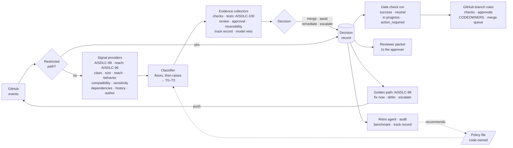
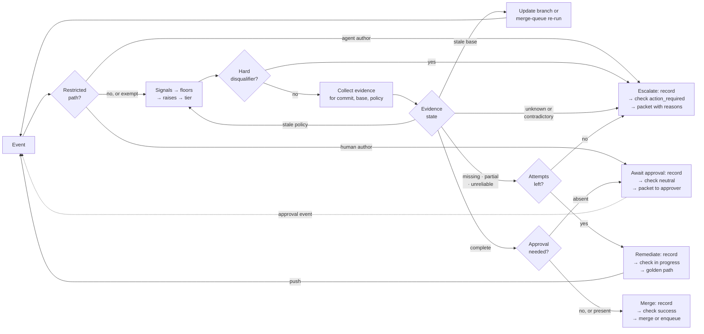
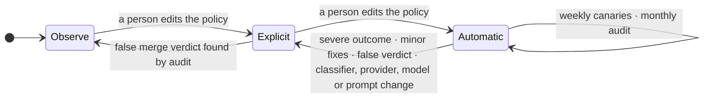

# AISDLC-97: Define Risk-Tiered MVE and Mergeability Contract

**Architecture design proposal.** Status: draft for architecture review · Owner: Guy Oron · Reviewers: Ella Shulman
(lead architect, owner of [AISDLC-29]), Benjamin Kapner · Date: 2026-09-28 · Jira: [AISDLC-97] (epic) under
[AISDLC-29] (feature). Terms and references: Appendix A. Every number is a policy default: Appendix B.

## 1. Summary

**Problem.** [AISDLC-29] (Architecting Verification Debt Resolution & Minimal Viable Evidence for ADLC Auto-Merge)
asks for "the specific, dynamic testing thresholds an agent must meet to qualify for an auto-merge, based on the scope
of the change", and names the two failures to avoid: shipping regressions, and blocking agents forever on flaky
integration tests. The setting is the **ADLC** (agentic software development lifecycle) on **fullsend**, the
open-source platform of forge agents (triage, code, review, fix, retro) that this design targets on GitHub. Today in
fullsend every PR needs a human approval, the existing risk score ([ADR 0089], PR-level risk assessment scoring) gates
nothing, and low-risk dependency bumps wait 8–36 hours for a click (2026-09-23 triage comment on [fullsend#3016]).

**Decision, in six points.**

1. **A merge gate, not a merge bot.** A **trusted runtime** (a GitHub App run by the platform, outside any agent's
   sandbox, holding the only merge credential) computes one verdict per PR commit, **merge**, **await approval**,
   **remediate** or **escalate**, publishes it as a required GitHub check, and on *merge* merges through the
   repository's own merge path after re-fetching GitHub state. GitHub keeps enforcing checks, approvals, CODEOWNERS
   and the merge queue. This is the authority boundary of [ADR 0110] (dedicated auto-merge authority boundary,
   [fullsend#7151], unmerged), with one stated departure: the deterministic policy recommends and the model may only
   veto, where ADR 0110 asks the agent to recommend.
2. **Risk tier from consequence, not from file counts.** Four **risk tiers** T0–T3 are set by the riskiest signal
   (floors), never by an average; weaker signals can only raise the tier. The nine signals (change class, size, reach,
   behavior change, interface compatibility, sensitivity, dependencies, history, author) come from pluggable
   providers; the rule is fixed. Restricted paths (rules, prompts, credentials) are a separate policy evaluated first.
3. **Evidence scales with the tier, and unknown never merges.** Each tier names its **minimal viable evidence** (MVE).
   Missing evidence goes to [AISDLC-98]'s golden path (Define Verification Debt Taxonomy and Resolution Golden Path:
   fix now, defer as debt, or escalate); stale, contradictory or unmeasurable evidence never counts. **Agent-authored
   PRs keep one human approval at every tier**, as we read Red Hat's [AI code assistant guidelines] (question 10.1);
   for them the contract decides what must be in place before a person is asked, and which person; the gate then
   merges on its own. Under the September check-script rules (`tier_check.py`, run 2026-09-23 on the 246 PRs of
   [fullsend#4698], the risk-score measurement thread; not rerun under this document's rules), 13 of 246 PRs would
   merge with no approval; the other 35 candidates were opened by an allowlisted bot.
4. **Every decision writes a record before it acts.** The record binds PR, commit, base, policy version, every signal
   with its provider and version, the evidence and the outcome. Audits, fullsend's retro agent (which runs when a PR
   closes), the benchmark of past PRs (section 7) and the track record read it; only people turn what they read into
   policy.
5. **The system only tightens itself; people loosen it.** A severe outcome stops automatic merging at once; a poor
   track record (the tier's count of gate merges and its 30-day fix rate) revokes it; a classifier, provider, model
   or prompt change resets the track record. Every promotion is a code-owned edit of the policy file. fullsend's fleet
   configuration already rejects "a less-restrictive candidate unless the manifest explicitly declares that
   relaxation" ([ADR 0122], declarative repo configuration).
6. **Deterministic decision, pluggable signals.** The same inputs give the same verdict; which tool supplies an input
   is a per-repository choice, recorded by name and version. "Every decision should be traceable to its inputs"
   ([fullsend vision]).

**What we need from readers.** Confirm the six points and the split with the sibling epics (section 2). The open
questions in section 10 carry names: Ella (10.1, 10.5, 10.10, 10.12), Benjamin (10.2), the policy owner (10.1, 10.3),
fullsend maintainers (10.3, 10.13), fullsend telemetry owners (10.4), Adam Scerra (10.6), Hofni Gartner (10.6, 10.9).

## 2. Context

**What exists.** fullsend's review pipeline scores every PR 1–5 (metadata 50%, git history 30%, linked issue 20%;
62/38 with no issue). [ADR 0089] says the score "is informational only" and "the protected-path check remains the sole
blocking mechanism". That check (`REVIEW_PROTECTED_PATHS`, 22 path prefixes by default) downgrades any agent approval
to a comment when a changed file matches, computed outside the model and fail-closed on a missing file list. The
autonomy model is "binary per-repo with CODEOWNERS as the escape hatch" ([autonomy-spectrum]), with graduation criteria
"all TBD"; that document names per-decision dimensions as a layer on top of the binary model, and this design is that
layer. [ADR 0110] proposes a dedicated auto-merge stage and defers "schemas, trigger rules, queue protocols, storage,
reconciliation, rollout gates, and cohort definitions". Revert and defect rates after merge are not visible
([fullsend#6892]).

**Why it is hard.** Volume: at scale a required approval becomes a click. Generated code: one Kubernetes API field
regenerates deepcopy, CRDs, RBAC, clients and docs, so raw size and path rules misclassify the PR. Cross-repo reach: a
published Go API or CRD reaches consumers in other repositories, and GitHub offers no cross-repository PR dependency
(stacked PRs and issue dependencies are same-repository only). And ADR 0089 notes that its sub-agent re-emits the
deterministic signals, "introducing potential LLM-mediated non-determinism"; its re-reviews once flipped 1→2 on
identical rationale ([agents#1037], fixed by [agents#1038] with re-review anchoring). A model-emitted number cannot be
the gate.

**The sibling epics.** [AISDLC-97] decides how much evidence each risk tier needs and what happens when it is missing.
The siblings produce the evidence and tools; until they land, the fallback applies.

| Epic | Supplies to this contract | Fallback until it lands |
|---|---|---|
| [AISDLC-96] Define Change-Impact and Coverage-Adequacy Model | the blast-radius model, its confidence levels, what "adequate coverage" means | a dependents count stands in for reach; T1 and above never merge automatically |
| [AISDLC-98] Define Verification Debt Taxonomy and Resolution Golden Path | the debt categories (section 5.2) and the fix-now / defer / escalate path | evidence gaps go to a person |
| [AISDLC-99] Assess Verification Tooling Capability and Architecture Gaps | a provider for each signal and each piece of evidence | a signal with no provider follows the applicability rule (section 4.3); evidence with no producer is missing (section 5.2) |
| [AISDLC-100] Design Minimal Relevant Test Selection and CI Capacity Strategy | which tests meet each tier's bar; flaky, slow and unavailable tests | full suites run |

## 3. Architecture



Legend: [AISDLC-96] Define Change-Impact and Coverage-Adequacy Model · [AISDLC-98] Define Verification Debt Taxonomy
and Resolution Golden Path · [AISDLC-99] Assess Verification Tooling Capability and Architecture Gaps · [AISDLC-100]
Design Minimal Relevant Test Selection and CI Capacity Strategy.

**Events** drive the loop (PR opened, synchronized, base changed, ready for review; check completed; review submitted;
`merge_group` checks requested; policy file changed; a declared dependency PR closed): no polling, no fixed wait. The
design assumes a webhook can be missed, so a reconciliation sweep lists open PRs whose gate check is missing or stale,
and the check can be re-requested from the PR page or GitHub's rerequest endpoint. **Signal providers** are
per-ecosystem tools behind one interface: value, confidence, provider name and version; the capability matrix is
[AISDLC-99]'s. **Evidence collectors** read GitHub state and CI outputs and never trust PR text; the review verdict is
read from the review result, since the bot's native review is advisory to GitHub, which counts only human approvals
([agents#1449] proposes a check run for it).

## 4. Policy model

### 4.1 Restricted paths

A per-repository list of paths only people change: CODEOWNERS and branch rules, the policy file, agent prompts and
harness files, credentials and provider configuration, release configuration. An agent-authored PR touching one is
escalated with the reason; a human-authored one awaits approval by the path's code owner; an exempt change (a
digest-only or patch bump by an allowlisted bot whose diff is the manifest and lockfile alone) passes its own
deterministic check with no tiering. fullsend's `REVIEW_PROTECTED_PATHS` (section 2) already implements the mechanism;
this design adds the policy path to it (`.fullsend/` is not in the default list today) and moves the bot-bump
exemptions the backlog asks for ([fullsend#7611], [fullsend#3239]) out of the prefix list. **Policy owner** = the code
owners of the policy path; on fullsend `main`, `@fullsend-ai/core` through `CODEOWNERS` `*`, enforced by
`require_code_owner_review: true`.

### 4.2 Risk tiers

A risk tier describes the consequence of a change if it is wrong and how easily it is undone. It is not [ADR 0089]'s
1–5 score and not fullsend's autonomy level; both are inputs.

| Risk tier | Definition |
|---|---|
| **T0 Pre-authorized** | no intended behavior change in shipped code: docs only; tests only; a patch, pin or digest dependency bump that passes supply-chain checks |
| **T1 Low** | a behavior change nothing reaches yet: new files or functions with no callers, or code behind a default-off flag; small hand-written size; few dependents |
| **T2 Standard** | a behavior change on reachable code inside the repository, compatible interfaces, nothing sensitive, no new dependency |
| **T3 Sensitive** | reaches other repositories or breaks an interface; auth, secrets, CI structure, migrations; new dependencies or minor/major bumps; irreversible or data-affecting; anything larger |

### 4.3 Signals, floors and raises

**Change class comes first** and decides which signals apply. Generated and vendored files count as generated only
when a CI job regenerates them and finds no diff. Size is hand-written code lines (added plus removed) and files,
excluding docs, tests, generated and vendored files.

| Change class | Signals that apply | Floor from the class |
|---|---|---|
| docs-only | change class | T0 candidate |
| tests-only | change class, history (test weakening is a disqualifier, section 5.2) | T0 candidate |
| dependency-only | dependencies, sensitivity | T0 candidate, or T3 |
| configuration (CI, deployment, flags) | sensitivity, behavior change, size, history | T1 or above |
| generated only | the verify-generated job | the tier of the hand-written diff it came from; T0 if none |
| code | all | T1 or above |

**Not applicable** is a function of the change class only. A signal the class needs but the repository has no provider
for is **unknown**, unless the policy file declares a named waiver, which is written to the record; a signal whose
provider ran and failed is unknown. **Floors: the riskiest applicable signal sets the tier, and nothing averages it
down.** Raises then add. Unknown never lowers: an unknown floor input sets that floor to its highest value; an unknown
raise input counts as fired. A repository's optional declared-path list raises by one.

| Signal | Floor | Raise | Example public providers (never a recommendation) |
|---|---|---|---|
| **Size** | over the T1 limit → T2; over the T2 limit → T3 | – | `git diff --numstat`; `linguist-generated`; verify-generated jobs (kubernetes `verify-codegen`, kubevirt `generate-verify`, cluster-api `verify-gen`) |
| **Reach** (dependents in the repo; consumers in other repos; callers of changed symbols) | ≥ N dependents → T2; any consumer outside the repo → T3; [AISDLC-96]'s model replaces the count when it lands | low or unknown confidence → +1 | `go list -deps`, Bazel `rdeps`, Nx affected, jdeps; pkg.go.dev "Imported By" (`kubevirt.io/api/core/v1`: 784 importers), GitHub dependency graph (public repos only), Sourcegraph, a SCIP index; gopls or pyright call hierarchy |
| **Behavior change** (a line inside an existing function; code that first gains callers; a flag default flipped) | first-caller PR: the classifier re-runs on the diff of the code being wired in, with reach taken at the call site, and the PR takes the higher tier; a default flip: the same on the code the flag guards, never below T2 | – | call hierarchy from a code index; a diff of the flag definition file (OpenFeature CLI manifest, flagd), a convention rather than a tool feature; Kubernetes `verify-featuregates` |
| **Interface compatibility** (Go API, CRD, OpenAPI, protobuf, Java) | breaking → T3 | – | go-apidiff, gorelease; crdify, crd-schema-checker; oasdiff; `buf breaking`; japicmp |
| **Sensitivity** (auth, secrets, crypto, tokens, RBAC, CI structure, migrations; a new import of a risky standard package) | → T3; risky import → T2 | – | [ADR 0089]'s security patterns; repository policy |
| **Dependencies** | new dependency, minor or major bump → T3; patch, pin or digest with clean supply-chain checks → T0 | – | manifest and lockfile diff; OSV-Scanner; OpenSSF Scorecard |
| **History** (a touched file reverted in 90 days; co-change partner missing; churn hotspot; untouched 180 days; "workaround" or "hack" commits; [ADR 0089] score ≥ 3) | – | revert → +1; two or more of the others → +1 | `git log`, code-maat, PyDriller; the ADR 0089 sub-agent |
| **Author and intent** (agent, AI-assisted, human, allowlisted bot; labels) | issue labeled security or breaking-change → T3 | – | GitHub API; commit trailers |

The derived tier of a first-caller or flag-flip PR is written to the record with its source diff.

### 4.4 Policy file (proposed shape)

One YAML block per repository, code-owned, layered preset → repository overlay, tighten-only on overlay. Field names
are placeholders; [ADR 0080] (config.yaml vs agent env var scope) puts dispatch policy in `.fullsend/config.yaml`.
Example values are for a Go and kubebuilder repository.

```yaml
merge_policy:                       # proposed; no such key exists in fullsend today
  mode: { T0: explicit, T1: observe, T2: observe, T3: observe }   # observe | explicit | automatic
  restricted_paths: { inherit: true, add: [.fullsend/], exemptions: [bot-digest-bump] }
  approvers: { T0: branch rule, T1: branch rule, T2: team, T3: code owner }   # agent-authored: always a person
  limits: { T1: {files: 10, lines: 100}, T2: {files: 25, lines: 800} }
  reach: { provider: <reach-provider>, dependents_floor_T2: 10, cross_repo_index: <org index> }
  compatibility: { providers: [<api-diff>, <schema-diff>] }
  waivers: []                       # signals a class needs but this repository cannot compute; each use is recorded
  history: { revert_days: 90, quiet_days: 180, raise_signals: 2 }
  evidence: { changed_lines_executed_T2: 0.80, checks_expected_time_pctl: 95 }
  fix_attempts: { per_commit: 2, per_pr: 4 }
  track_record: { min_merges: 50, max_fix_rate_30d: 0.02, resets_on: [classifier, provider, model, prompt] }
  revoke: { severe: immediate, minor_fixes_30d: 2 }
  branch_update: merge              # or rebase; no repository setting for the method was found
  record: { check_run: fullsend/merge-gate, store: <acknowledged store>, otel_mirror: true, retention_months: 12 }
  revert_runbook: docs/runbooks/revert.md   # required before automatic mode
```

## 5. Evidence

### 5.1 Minimal viable evidence per risk tier

All evidence is for the exact commit. At every tier GitHub already requires green checks and the gate reads the review
verdict from the review result (section 3); both are recorded.

| Evidence | T0 | T1 | T2 | T3 |
|---|---|---|---|---|
| Tests cover the change ([AISDLC-96] criteria, [AISDLC-100] selection) | existing suite; none for docs | tests that reference the changed code | a test executed the changed hand-written lines (policy threshold) | as T2, plus integration or e2e, and consumers' tests when other repositories use it |
| Human approval | explicit mode: the branch rule's approval; automatic mode: none | as T0 | a team member | the code owner |
| Reversible | – | new code only, or a default-off flag | not irreversible | revert note if irreversible |
| Track record (automatic mode only) | ✓ | ✓ | – | – |
| Model check: no concern (veto only) | docs and digest bumps: not required; otherwise ✓ in automatic mode | ✓ in automatic mode | advisory | advisory |

Agent-authored PRs add one human approval at every tier (section 1, point 3): fullsend's review is authorship-blind
([code-review]: "The review agents don't know or care about authorship"); this merge policy is not, for the reason in
question 10.1. Evidence this repository has no producer for is missing (section 5.2), never silently passed.

**Model check.** Fixed yes/no questions, each phrased so that "yes" is a concern: exceeds the linked issue's scope;
weakens tests; removes a safeguard; contradicts its description; a dependency change does more than the bump it claims.
Each answer carries a probability checked against the benchmark's labeled outcomes (section 7); until that check
exists, the model check is advisory everywhere. It can block, never approve (question 10.12).

**Substitutes** count only if the policy file declares them, and each use is recorded: agent-written tests that passed
[AISDLC-98]'s golden path and ran in CI on this commit; a recorded debt item in place of the coverage when the package
has no measurable coverage, after which the PR needs the next tier's approval instead (T2: a team member; T3: the code
owner); [AISDLC-100]'s selected subset at T1 when its confidence is high; a merge-queue run on the merged result for
"checks on the exact commit"; the consumer's code owner approval when the consumer's tests cannot run.

**The reviewer packet.** Any PR that waits for a person carries, in the gate's check run and its comment: what changed
and why; the signals that set the tier; each piece of evidence and what is missing; and how to try it, at a level the
repository opts into: written demo steps from the agent; the same steps executed by CI with the output attached; a
per-PR preview environment published as a GitHub Deployment with `environment_url` (Argo CD's pull-request generator is
a public example of the environment itself; it does not publish to GitHub). The record keeps time to approval (the
release-candidate OpenTelemetry metric `vcs.change.time_to_approval`) and whether the approver commented, so a
click-through on a 2,000-line diff is visible in audits; GitHub does not expose which files an approver opened, so depth
is time and comments only. The literature disagrees on whether review participation predicts defects ([McIntosh 2014]
versus [Krutauz 2020]; at Google the median change has one reviewer, and small changes get first feedback in under an
hour, [Sadowski 2018]), so no threshold flags a person yet (question 10.2). Whether a change fits project strategy is a
triage and prioritization question and stays outside the gate.

### 5.2 Decision loop

Hard disqualifiers, checked before any evidence: an agent-authored PR edits the gate's own rules or prompts; the PR is
a draft; its author is also its approver, or the agent would merge its own work; it has no linked issue at T1 and
above; it weakens tests (an assertion removed, a test skipped, deleted or mocked away, found deterministically). Any one
escalates.



**Outcomes and the check run.** GitHub treats a `neutral` or `skipped` required check as passing and blocks only on
`failure` or `action_required`; the four outcomes use that. **Merge:** `success`; the trusted runtime re-fetches GitHub
state and merges through the repository's merge path with its own least-privilege identity, or, where the branch
requires a merge queue, enqueues and re-authorizes the queue's revision. GitHub's merge-when-ready is not used, as
[ADR 0110] says (it also cannot enqueue on queue-protected branches with strict checks, [fullsend#5849]). A new push
needs a new verdict. **Await approval:** `neutral`, titled with the approver from the policy's `approvers` field; the
approval event re-enters the loop, so in explicit mode the gate merges on the exact approved commit once its own
evidence is complete, and the approver never clicks merge. **Remediate:** the check stays in progress while the gap is
worked through [AISDLC-98]'s path. **Escalate:** `action_required` with the reasons; a person with bypass can still
merge, and GitHub's rule insights log it. In observe mode the check is not required and every verdict is published as
`neutral` with the would-be outcome in its title. GitHub's required approval is a branch rule, not a tier rule, so
automatic mode needs the branch's approval requirement dropped; the gate then enforces approval for every other tier
and for agent authors, and *await approval* concludes `action_required` until the approval event arrives.

| Evidence problem ([AISDLC-98]'s taxonomy) | What the merge decision does |
|---|---|
| missing or unavailable | remediate by running what produces it; if nothing can, defer as debt or escalate |
| irrelevant or partial (tests ran, but no test executed the changed lines) | remediate (add tests) or defer as debt; never merge on it |
| stale (older commit, base or policy) | base moved: evidence goes stale only when branch rules require an up-to-date branch or the intervening commits touch the same packages; then update the branch per the repository's convention, or let a merge queue re-run on the merged result. Policy changed: recompute only |
| flaky or non-reproducible | one re-run; a second failure is real. T0–T1 accept only flaky tests already marked as such by [AISDLC-98]'s path that the change does not touch |
| slow | a required check past its own expected time (a percentile of its past durations, kept in the record) counts as unavailable |
| contradictory (CI green but no test executed the changed lines; `risk/low` on a sensitive path; two reviews disagree) | escalate with both readings; human signals outrank bot signals |

**Trace of PR B-1 (section 8)**, the consumer bump plus 9 lines using a new field. Push c1: change class code, reach 0
dependents, compatibility not applicable, T1; checks present, changed lines executed 0 of 9, partial → remediate,
record written, attempt 1 of 2, reason `coverage_partial`, check in progress. The agent pushes c2 with a unit test: 9 of
9 executed, checks green, review verdict clean; T1 in explicit mode → await approval, record written, check `neutral`
"Awaiting the branch rule's approval". Approval submitted → the loop re-enters → merge, record written, check `success`,
the trusted runtime merges c2.

## 6. The decision record

One JSON document per verdict, shaped as an in-toto Statement so it can be signed later without a new format: `subject`
= what was decided about, `predicateType` = our URI, `predicate` = the decision. It holds no credentials and no PR
content beyond paths and counts (Level 1 metadata in [ADR 0050]'s terms, framework-native distributed tracing with
OpenTelemetry), and is the per-PR counterpart of the trust scorecard in [trustworthiness-evidence].

```json
{ "_type": "https://in-toto.io/Statement/v1",
  "subject": [{ "name": "fullsend-ai/fullsend#7890@a1b2c3", "digest": { "sha256": "<sha256 of this record's predicate>" } }],
  "predicateType": "https://redhat.com/adlc/merge-decision/v1",
  "predicate": {
    "head_sha": "a1b2c3…", "base_sha": "9f8e…", "merge_group_sha": null, "policy_hash": "sha256:…", "classifier": "0.3.0",
    "change_class": "code", "risk_tier": "T2", "mode": "explicit",
    "signals": [
      { "name": "reach.dependents", "value": 14, "confidence": "high", "provider": "go-list@1.25", "floor": "T2" },
      { "name": "compatibility", "value": "additive", "provider": "go-apidiff@0.8.3" },
      { "name": "behavior.flag_default_flip", "state": "not_applicable" } ],
    "evidence": [
      { "name": "checks", "state": "present", "source": "github:check_suite/…" },
      { "name": "changed_lines_executed", "state": "partial", "value": 0.61, "source": "codecov:patch" } ],
    "substitutes": [], "disqualifiers": [], "waivers": [],
    "outcome": "remediate", "attempt": 1, "reasons": ["coverage_partial"], "approver": null,
    "time_to_approval_s": null, "decided_at": "2026-09-28T10:04:00Z" } }
```

**Where.** One source of truth and two mirrors. The source is an acknowledged store written only by the platform host
with its own identity, never by PR authors or with the merge credential, so a leaked merge token cannot forge a record;
the check run concludes only after that write returns. Mirror one: the gate's check run on the commit (`external_id` =
record id, `details_url` = the record, summary = the packet), a pointer and a human view, not an archive, since GitHub
deletes check runs past 1000 per name and after the Actions retention period ([GitHub checks retention]). Mirror two: an
OpenTelemetry event on a `merge-gate` task span with the release-candidate `vcs.*` and `cicd.*` attributes and the
decision under the `fullsend.*` namespace, on the tracing fullsend already emits ([ADR 0050]); export there is
best-effort by design. Which backend holds the store for 12 months is an adopter decision (question 10.4). Under a merge
queue the final record keys on the queue's revision and links the PR head. **Who reads it:** the [retro agent], which
"runs automatically when a PR is closed (merged or not)" and files proposals as issues; the monthly audit; the
benchmark; and the trust scorecard's `track_record`, keyed by configuration hash.

## 7. Trust over time



Per repository and risk tier. **Observe** (fullsend's "shadow mode"): the gate classifies and publishes the tier and
the gaps as a `neutral` check; the gate merges nothing and PRs merge as they do today. **Explicit:** today's required
approval stays, but the gate merges, on the exact approved commit and only once its evidence is complete.
**Automatic:** T0, later T1, merges with no approval for PRs by people or allowlisted bots.

- **Tightening is automatic.** A severe outcome (a security issue, a user-facing regression, data loss, or the andon
  cord in [production-feedback]: a deploy drives a signal above its pre-deploy baseline) **revokes** automatic mode for
  that repository and tier at once and quarantines agent activity in the affected path. The policy's minor-fix count in
  30 days revokes it too, as does a false merge verdict found by the audit. A change to the classifier, a provider, the
  model or the prompts resets the track record ("a configuration change resets the track record for the dimensions
  affected by that change", [trustworthiness-evidence]); a policy edit that changes a mode or a threshold does not, so
  a record earned in explicit mode carries into automatic mode.
- **Loosening is a person's edit** of the policy file, reviewed by its code owners, on the recommendation of the
  readers of the record. A *decision* is the final verdict on a merged PR; the track record's bar is the policy's
  minimum count of gate merges with at most its 30-day fix rate. The minor-fix rule revokes on its own; the rate is the
  bar a person checks before promoting.
- **Canaries** run on every policy, model or prompt change and weekly: planted PRs that must escalate (an out-of-scope
  edit, a weakened test, a hidden instruction in the PR body or code, a rules-file edit, a split-PR wiring, a flag
  flip), and deliberately broken providers that must yield "unknown" and never a merge (a missing check, a coverage
  tool returning nothing, a model timeout).
- **Monthly audit.** A person reads a random sample of gate verdicts: automatic merges against their issues, and
  explicit-mode verdicts against what the approver found. Findings count toward the track record.
- **Benchmark** (proposed by Hofni Gartner for the [AISDLC-99] tooling assessment; moved into this epic by Ella). Past
  PRs across several repositories, labeled by what happened after merge (a revert, a fix PR referencing them, a customer
  case) and how severe it was. For each tier: would the gate have merged a PR that later needed a fix, and which signal
  would have caught it? It sets the defaults in Appendix B and checks the model check's probabilities. The 246 PRs of
  [fullsend#4698] were collected to evaluate the [ADR 0089] scorer and their defects come from review findings, so they
  test the pipeline, not the thresholds. Outcomes need [fullsend#6892].
- **Revert plan**, a precondition for automatic mode: who reverts (the tier's code owner); how to find affected merges
  (the record, plus a label on automatic merges); what to do when later work is built on top (revert newest first, turn
  the flag off, or fix forward with a person); a drill in the canary suite. Across repositories no atomic merge exists
  on GitHub, so the compensating control is a revert of the whole set, keyed by the record.

**Mock timeline, one repository, T0.** Days 0–30 observe: 52 merged PRs classified, 0 false merge verdicts, 3 with the
reach provider timed out (unknown; rerun clean). Day 31: a code owner sets `T0: explicit`. Days 31–75: 61 T0 merges by
the gate after approval, median time to approval 4 h → 20 min (the packet). Day 76: baseline from [fullsend#6892] and
canaries green; a code owner sets `T0: automatic` and drops the branch's approval rule; the explicit-mode record
carries (61 merges, 1 fix, 1.6%). Day 90: a dependency bump auto-merged at day 84 is reverted; one fix in 30 days,
below the revoke rule; the retro agent files a proposal to add the dependency's changelog to the packet. Day 95: the
model is upgraded; the track record resets; canaries run; automatic mode stays off until 50 new explicit-mode merges.

## 8. Worked examples (mock data)

Numbers are invented; provider verdicts are the expected outputs for the described diffs, not tool runs.

| PR | Files, lines | Decisive signal | Risk tier and evidence |
|---|---|---|---|
| Docs only (3 files) | +120/−40 docs | change class: no code | T0: link check, render |
| Renovate patch bump of `k8s.io/client-go`, vendored | 41 files, +912/−877, 0 hand-written | dependency: patch, lockfile consistent, OSV clean | T0: build, unit, one smoke e2e |
| New helper `pkg/util/retry.go` nothing calls, with tests | +45 code, +80 tests | reach: 0 callers | T1: unit tests |
| The PR that wires the helper into `Reconcile` | +6/−2 | behavior: first caller on the hot path; classifier re-runs on the helper's diff at that reach | T2: envtest on the reconcile loop; the helper's diff in the packet |
| Flag flip `--enable-live-migration` default off → on | +1/−1 | behavior: default flip of a whole feature | the feature's tier, at least T2: full e2e of the feature, upgrade test, revert = flip back |

**Deep walkthrough: a Kubernetes operator API change across two repositories.** Repo A `vm-operator` (kubebuilder
layout) adds an optional field `spec.memoryOvercommitPercent` to `VirtualMachine` and honours it in the reconciler.
Repo B `vm-backup-operator` imports A's `api/v1` and reads the field.

| | PR A-1: optional field | PR A-2 (contrast): tighten a validation pattern on an existing field | PR B-1: module bump plus 9 lines using the field |
|---|---|---|---|
| Raw size | 12 files, +380 (8 generated: deepcopy, CRD, RBAC, applyconfiguration, clientset, docs) | 2 files, +2/−2 | 7 files, +55 (5 vendored) |
| Hand-written size | 3 files, +53/−5 | 1 file, +1/−1 | 1 file, +9/−2 |
| Generated integrity | verify-generated job green → excluded | green | `go mod vendor` clean → excluded |
| Compatibility | additive (crdify clean, go-apidiff compatible) | **breaking**: existing objects may fail on update (crd-schema-checker: "tighten or loosen a regex") | not applicable (upstream additive) |
| Reach | api module: 14 dependents (3 in-org, 11 external); 3 CRD consumers without Go; `Reconcile` hot path | same, plus every existing `VirtualMachine` in every cluster | 0 dependents of B's API |
| Behavior | opt-in field; default unchanged | unconditional | new path only when the field is set |
| Tests | +61 envtest lines; 92% of changed hand-written lines executed | none | none on the 9 new lines |
| Naive rules | T3 on size and `api/` path | T1 on size | T0 "deps only" |
| **Risk tier** | **T3 by reach** (consumers outside the repo): envtest, one e2e on the field, consumers' tests or their owners' approval | **T3 by compatibility**: CRD compatibility gate, upgrade test with existing objects, revert runbook | **T1 by reach, with a gap**: remediate with a unit test on the 9 lines; then merge (trace in section 5.2) |

## 9. Rollout, alternatives, consequences

**Rollout.** Each step is a person's edit of the policy file.

| Step | What happens | Needs first |
|---|---|---|
| 1 Observe | classify every PR and publish tier and gaps as a `neutral` check, for the observe minimum in Appendix B | a classification script for change class, paths, size, dependents, author and history, plus the disqualifier checks ([agents#1245], a script-computed signal tier and security floor, is a start); compatibility and behavior signals are unknown, or waived in the policy, until a provider is configured |
| 2 Explicit T0 | docs PRs and dependency bumps in one repository; the gate merges after the existing required approval | the verdict as a required check from the gate's App, pinned as the check's expected source ([agents#1449] is the precedent); approvals dismissed on push; supply-chain checks; the merge identity and the enqueue path |
| 3 Automatic T0 | PRs by people and allowlisted bots merge with no approval | no false merge verdict in observe; outcome baseline ([fullsend#6892]); canaries green; revert runbook; the branch's required approval dropped, with the gate enforcing approval for T1–T3 and agent authors |
| 4 T1, then hold | T1 next; T2 and above stay human-approved until the data says otherwise | [AISDLC-96]'s impact model; reversibility and weakened-test providers from [AISDLC-99]; a calibrated model check on an approved model |

**Critical path.** Automatic mode beyond docs and digest bumps depends on post-merge outcomes ([fullsend#6892], open,
owner Adam Scerra), which the benchmark needs to set thresholds and to calibrate the model check, and on a model
approved under Red Hat's [AI code assistant guidelines] ([AISDLC-99]). The fallback is automatic T0 for docs and digest
bumps only, which needs neither. Of the 13 PRs that qualified under the September check-script rules (section 1), 9
were docs PRs by maintainers and 4 dependency bumps by an allowlisted bot; 15 if PRs from members' forks count as
member-authored.

**Alternatives considered.**

| Alternative | Why not, or how it is used |
|---|---|
| A score or a model as the tier | an average dilutes one serious signal, and the model's own re-reviews disagreed (section 2); the score is kept as a raise, the model as a veto |
| A static list of core paths | the operator case (section 8) and the change-type asks in fullsend's backlog (section 4.1); kept only as a raise |
| Merge on green CI (Renovate `automerge`, Dependabot with GitHub auto-merge, Kodiak) | decide from PR attributes and the platform's fixed check list; none scales verification with the change |
| A generic policy engine (Mergify rules, Prow Tide, GitHub rulesets, OPA) | attribute predicates on labels, paths, checks, approvals; none computes reach. OPA is a fine evaluator for the policy file once signals are inputs |

**Costs.** A GitHub App with an acknowledged store and a merge identity; one provider per ecosystem per signal; a
policy file per repository; canary and runbook upkeep. **Risks.** Evidence gaming (split PRs, tests that touch but do
not test); provider drift changing tiers silently (versions are in the record); approval fatigue moving from PRs to
escalations; over-blocking from unknowns while providers are immature, which is why observe mode comes first.

## 10. Open questions

| # | Question | Owner | Our lean |
|---|---|---|---|
| 1 | Is our reading of Red Hat's [AI code assistant guidelines] right: agent-authored PRs always get a human approval; a human author, AI-assisted or not, is the person in the loop; a bot bump with no AI in it is outside them? | policy owner; Ella | keep the approval; let the record show when it stops adding information |
| 2 | Approval at scale: is a packet plus time-to-approval enough, or should a cap on agent PRs per approver and a "rubber stamp" threshold exist? Benjamin's term "approver agent": a person or an agent? | Benjamin | measure in observe; no threshold yet; the approver is a person |
| 3 | Who is the policy owner outside fullsend? | policy owner; fullsend maintainers | the code owners of the policy path |
| 4 | Which backend keeps the record's store for 12 months, and who runs it? Retention is still open in fullsend's tracing work ([ADR 0108], tool-call span topology; [fullsend#294], trace granularity and retention) | fullsend telemetry owners | the acknowledged store with an explicit 12-month retention setting; the OTLP backend keeps the mirror on its own retention |
| 5 | Is the "post" agent the [retro agent]? It runs at PR close, before outcomes exist. Second trigger: a revert or fix PR referencing the merged PR re-runs `/fs-retro` with the outcome as direction? | Ella | yes to both |
| 6 | What counts as a post-merge outcome (a revert, a fix PR referencing the merge, a customer case), and the look-back window? | Adam Scerra ([fullsend#6892]); Hofni Gartner for the benchmark | revert or fix PR within 30 days; customer case any time |
| 7 | Multi-repo PR sets: declare-and-wait (a `Depends-On` footer, as Zuul reads it), or merge-order enforcement? Atomicity across repositories does not exist on GitHub | [AISDLC-96], this epic | declare-and-wait now; producer merges before consumers |
| 8 | Reach for private repositories: an org-wide `go.mod` scan or a SCIP index (the GitHub dependency graph covers public repositories only)? | [AISDLC-99], [AISDLC-96] | list both in the capability matrix |
| 9 | The defaults in Appendix B | Hofni Gartner's benchmark | starting values as listed |
| 10 | After a classifier, provider, model or prompt change: a full reset to explicit, or a shorter probation? | Ella | full reset |
| 11 | The revert runbook: this epic requires it; who writes it? | repository code owners; [AISDLC-98] for the template | a template here, filled per repository |
| 12 | Which model answers the model check, approved under which policy, fed what sanitized context? | [AISDLC-99]; Ella | decide after observe-mode data exists |
| 13 | Should the review bot publish a check run for its protected-path verdict now ([agents#1449])? | fullsend maintainers | yes, as the precedent for step 2, whose check must come from the gate's App |

## Appendix A. Terms and references

- **Terms.** *ADLC*: agentic software development lifecycle. *fullsend*: the open-source platform of forge agents
  (triage, code, review, fix, retro) at github.com/fullsend-ai. *Trusted runtime*: the platform-run GitHub App outside
  any agent sandbox that holds the merge credential. *Risk tier*: T0–T3, section 4.2. *Change class, floor, raise, not
  applicable, unknown, waiver*: section 4.3. *MVE*: the evidence a tier needs, section 5.1. *Decision record*: section
  6. *Restricted path*: section 4.1. *Observe, explicit, automatic*: section 7. *Escalate*: hand to a person.
  *Revoke*: the system removes a mode. *Quarantine*: halt agent activity in a path. *Andon cord*: fullsend's
  halt-on-signal model in [production-feedback]. *Self-merge*: the author approving, or the agent merging, its own work.
- **Jira.** [AISDLC-29] (feature; owner Ella Shulman) and its epics [AISDLC-96], [AISDLC-97] (this document),
  [AISDLC-98], [AISDLC-99], [AISDLC-100]; full titles in section 2.
- **fullsend.** [ADR 0089] PR-level risk assessment scoring (accepted 2026-07-30). [ADR 0110] dedicated auto-merge
  authority boundary ([fullsend#7151], proposed, unmerged). [ADR 0050] framework-native distributed tracing with
  OpenTelemetry. [ADR 0080] config.yaml vs agent env var scope. [ADR 0108] tool-call span topology. [ADR 0122]
  declarative repo configuration. Problem docs [autonomy-spectrum], [trustworthiness-evidence], [production-feedback],
  [code-review], [fullsend vision]; the [retro agent]. Issues and PRs: [fullsend#294] trace granularity and retention
  policy; [fullsend#3016] auto-merge for low-risk Renovate updates; [fullsend#4698] the risk-score measurement thread;
  [fullsend#5849] auto-merge cannot enqueue on merge-queue branches with strict checks; [fullsend#6892] revert and
  defect rates not visible (owner Adam Scerra); [fullsend#7611], [fullsend#3239], [fullsend#3675] change-type-aware
  protected paths; [agents#1037] inconsistent scores across re-reviews (closed) and [agents#1038] its fix;
  [agents#1449] a check run for the protected-path verdict; [agents#1245] script-computed signal tier 1 (metadata) and
  a security floor (open).
- **Policy.** [AI code assistant guidelines]: Red Hat's guidelines for responsible use of AI code assistants (internal).
- **Standards, platform, research.** [GitHub Checks API], [GitHub checks retention], [GitHub merge queue],
  [GitHub auto-merge], [in-toto Statement], [OpenTelemetry CI/CD conventions], [Kubernetes API change rules],
  [Sonar quality gate], [Cloudflare's AI code review] (review-effort tiers; 0.6% break-glass rate); [McIntosh 2014],
  [Sadowski 2018], [Krutauz 2020].

## Appendix B. Defaults

A value with no source is our starting guess; the benchmark checks it.

| Default | Value | Source |
|---|---|---|
| T1 size | 100 hand-written lines, 10 files | lines from Cloudflare's "lite" review tier (≤ 100 lines, ≤ 20 files), which sizes review effort, not evidence; the file count is ours |
| T2 size | 800 lines, 25 files | |
| Dependents floor | 10 → T2 | |
| Changed lines executed at T2 | 80% | [Sonar quality gate] default for new code |
| History raises | a revert in 90 days; two of: co-change partner missing, churn hotspot, 180 days untouched, hack messages, ADR 0089 score ≥ 3 | [ADR 0089]'s git-history signals plus a commit-message heuristic of ours; windows are ours |
| Fix attempts | 2 per commit, 4 per PR | checked by observe data |
| Slow check | past the 95th percentile of its own durations | checked by observe data |
| Track record | ≥ 50 merges, ≤ 2% fixes in 30 days; observe ≥ 30 days and ≥ 50 merges | checked by the benchmark and [fullsend#6892] |
| Revoke | severe: at once; minor fixes: 2 in 30 days | checked by the monthly audit |
| Record retention | ≥ 12 months | checked by audit |

[AISDLC-29]: https://redhat.atlassian.net/browse/AISDLC-29
[AISDLC-96]: https://redhat.atlassian.net/browse/AISDLC-96
[AISDLC-97]: https://redhat.atlassian.net/browse/AISDLC-97
[AISDLC-98]: https://redhat.atlassian.net/browse/AISDLC-98
[AISDLC-99]: https://redhat.atlassian.net/browse/AISDLC-99
[AISDLC-100]: https://redhat.atlassian.net/browse/AISDLC-100
[ADR 0089]: https://github.com/fullsend-ai/fullsend/blob/main/docs/ADRs/0089-pr-risk-assessment-scoring.md
[ADR 0110]: https://github.com/fullsend-ai/fullsend/pull/7151
[ADR 0050]: https://github.com/fullsend-ai/fullsend/blob/main/docs/ADRs/0050-distributed-tracing-instrumentation.md
[ADR 0080]: https://github.com/fullsend-ai/fullsend/blob/main/docs/ADRs/0080-config-yaml-vs-agent-env-var-scope.md
[ADR 0108]: https://github.com/fullsend-ai/fullsend/blob/main/docs/ADRs/0108-tool-call-span-topology.md
[ADR 0122]: https://github.com/fullsend-ai/fullsend/blob/main/docs/ADRs/0122-declarative-repo-configuration.md
[autonomy-spectrum]: https://github.com/fullsend-ai/fullsend/blob/main/docs/problems/autonomy-spectrum.md
[trustworthiness-evidence]: https://github.com/fullsend-ai/fullsend/blob/main/docs/problems/trustworthiness-evidence.md
[production-feedback]: https://github.com/fullsend-ai/fullsend/blob/main/docs/problems/production-feedback.md
[code-review]: https://github.com/fullsend-ai/fullsend/blob/main/docs/problems/code-review.md
[fullsend vision]: https://github.com/fullsend-ai/fullsend/blob/main/docs/vision.md
[retro agent]: https://github.com/fullsend-ai/fullsend/blob/main/docs/agents/retro.md
[fullsend#294]: https://github.com/fullsend-ai/fullsend/issues/294
[fullsend#7151]: https://github.com/fullsend-ai/fullsend/pull/7151
[fullsend#3016]: https://github.com/fullsend-ai/fullsend/issues/3016
[fullsend#5849]: https://github.com/fullsend-ai/fullsend/issues/5849
[fullsend#6892]: https://github.com/fullsend-ai/fullsend/issues/6892
[fullsend#4698]: https://github.com/fullsend-ai/fullsend/issues/4698
[fullsend#7611]: https://github.com/fullsend-ai/fullsend/issues/7611
[fullsend#3239]: https://github.com/fullsend-ai/fullsend/issues/3239
[fullsend#3675]: https://github.com/fullsend-ai/fullsend/issues/3675
[agents#1037]: https://github.com/fullsend-ai/agents/issues/1037
[agents#1038]: https://github.com/fullsend-ai/agents/pull/1038
[agents#1449]: https://github.com/fullsend-ai/agents/issues/1449
[agents#1245]: https://github.com/fullsend-ai/agents/pull/1245
[AI code assistant guidelines]: https://source.redhat.com/ (internal wiki; SSO)
[GitHub Checks API]: https://docs.github.com/en/rest/checks/runs
[GitHub checks retention]: https://github.blog/changelog/2026-07-17-actions-retention-will-cover-checks-workflow-runs-and-statuses/
[GitHub merge queue]: https://docs.github.com/en/repositories/configuring-branches-and-merges-in-your-repository/configuring-pull-request-merges/managing-a-merge-queue
[GitHub auto-merge]: https://docs.github.com/en/pull-requests/collaborating-with-pull-requests/incorporating-changes-from-a-pull-request/automatically-merging-a-pull-request
[in-toto Statement]: https://github.com/in-toto/attestation/blob/main/spec/v1/statement.md
[OpenTelemetry CI/CD conventions]: https://opentelemetry.io/docs/specs/semconv/cicd/
[Kubernetes API change rules]: https://github.com/kubernetes/community/blob/master/contributors/devel/sig-architecture/api_changes.md
[Sonar quality gate]: https://docs.sonarsource.com/sonarqube-server/quality-standards-administration/managing-quality-gates/introduction-to-quality-gates
[Cloudflare's AI code review]: https://blog.cloudflare.com/ai-code-review/
[McIntosh 2014]: https://dl.acm.org/doi/10.1145/2597073.2597076
[Sadowski 2018]: https://dl.acm.org/doi/10.1145/3183519.3183525
[Krutauz 2020]: https://arxiv.org/abs/2005.09217
